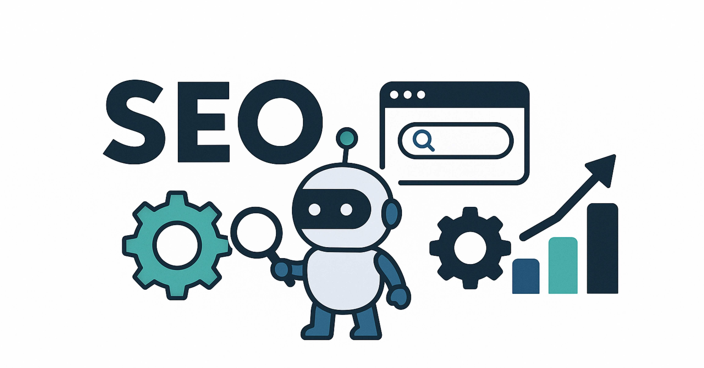

# SEO初心者の最短ルート｜Google公式×AI実務

> 出典: https://note.com/mine_unilabo/n/nd88a1abc889c  
> 公開状態: publish  
> 更新: Mon, 18 Aug 2025 21:19:14 +0900



五反田のスタートアップでプロダクト開発をしている、みね（@[mine\_take](https://x.com/mine_take)）です。
※本記事は個人の活動による記事であり、会社の公式見解ではありません
「検索から人を呼びたいので、SEOを強化したいのだけど、何から手をつければいい？」
そんな相談をよく受けます。こんなモヤモヤを、**Google公式×AI**でシンプルに解決するのが本記事です。全部をAIに丸投げはできませんが、面倒な“実務”はAIに任せ、人は**戦略と優先順位**に集中する。そんな進め方を戦略的に切り替えます。

実は私、SEOはもう“趣味”と言っているレベルです（笑）。
Googleのパーパス――「世界中の情報を整理し、世界中の人がアクセスできて使えるようにすること」に強く共感していて、情報を整理しわかりやすく届ける設計が好きなんです。**CtoC／BtoC／BtoB／オウンドメディア**のWebサイト（メディア）開発に関わってきた経験も踏まえ、今日から使える最短ルートを用意しました。
※本稿はAIで一部下書きを支援し、最終確認は人手で行っています。

**この記事では、**

- SEOの基礎（Google公式で最短理解）
- **AIに任せられること／任せられないこと**（期待値の線引き）
- 実務を回す**3ステップ（素材→診断→修正）**
- **最初の30分クイックスタート**（上位5URL＋SCクエリ→即修正）

…を、順を追ってお伝えします。読み終えたら、**タイトル／ディスクリプション**と**内部リンク**の“1本修正”から始めましょう。
※本記事ではAIで下書きを一部支援し、最終確認は人手で行っています。

## SEOの基礎（Google公式で最短理解）

まずは“土台”。ここを押さえると、余計な遠回りをせずに済みます。

SEO（検索エンジン最適化）とは、検索エンジン経由で自分のウェブサイトを見つけてもらいやすくするための総合的な取り組みです。検索結果の順位だけを上げる技術ではなく、「検索ユーザーに価値ある情報を届ける仕組み」を作ることが目的です。

検索エンジンは、世界中のウェブページをクロールし、データベースにインデックスし、その中から検索意図に合ったページをランキングして表示しています。したがって、自分のサイトが適切にクロール・インデックスされ、検索意図に合う情報を提供していることが基本条件になります。

### 検索の仕組み（クロール→インデックス→表示）

- **クロール**：クローラがページを見つける
- **インデックス**：内容を理解して保存
- **表示（ランキング）**：検索意図と品質を軸に結果を並べる
  やることはシンプル。**発見される構造**（内部リンク・サイトマップ・重複回避）と、**意図に合うページ**を用意すること。

Googleが公開している以下のドキュメントは、SEOの基礎を学ぶ上で欠かせません。

- **SEOスターターガイド**: タイトルタグやメタディスクリプションの書き方、見出し構造の設計、リンクの扱い方など、基本的な最適化方法がまとまっています。

  - 参考URL：<https://developers.google.com/search/docs/fundamentals/seo-starter-guide?hl=ja>

- **検索エッセンシャル（旧ウェブマスターガイドライン）**：検索結果に掲載されるための技術的な要件や、スパムとみなされる行為について解説しています。

  - 参考URL：<https://developers.google.com/search/docs/essentials?hl=ja>
- **Helpful Content ガイド**：ユーザー第一のコンテンツとは何か、信頼性と専門性を高めるためのポイントがまとめられています。

  - 参考URL：<https://developers.google.com/search/docs/fundamentals/creating-helpful-content?hl=ja>

これらを読むと「検索エンジンに評価される＝ユーザーに役立つコンテンツである」という基本が理解できるでしょう。具体的には次のような点を意識します。

- **適切なタイトルと説明文**：ページの内容を端的に表し、クリックしたくなる文言にする。
- **見出し・構造化**：`h1`や`h2`などの見出しを使って情報を整理し、読みやすくする。
- **内部リンク**：関連する記事同士をリンクでつなぎ、サイト内の回遊性を高める。
- **読みやすいコンテンツ**：ユーザーの疑問を解決する具体的な内容を用意し、専門用語には説明を添える。
- **モバイル対応と高速表示**：ページスピードやモバイル表示を改善し、ユーザー体験を向上させる。

これらの基礎は、小規模ブログや企業サイトでも必ず抑えておきたいポイントです。

### ＜ドキュメントの要点＞

### Search Essentials（Google検索セントラル）の要点

- 検索可能：robots.txt／noindexで**塞いでいない**
- 表示可能：**モバイル対応・HTTPS・適切な内部リンク**
- 理解可能：**H1〜見出し構造・画像の代替テキスト・構造化データ**（検索結果の見え方を助けるマークアップ）
  ※公式ガイドに沿えば“まず落とさない”作りになります。

### Helpful・people-first（中身の作り方）

- 冒頭で「**誰の／どの課題を／どう解決**」を明文化
- テンプレ量産ではなく、**経験・具体例・数値**を入れる
- 検索ユーザーの“次の行動”まで導線で支える（内部リンク）

## AIが代替できるのは“実務”。戦略は人が決める

AIは強い。でも“何をやるか”、“どれからやるか”は人の仕事です。

### AIが得意（収集・要約・案だし）

- **ページのデータ取得と整理**：サイトのタイトルタグやディスクリプション、見出し構造などを抽出し、欠けている部分を検出する。
- **コンテンツの改善提案**：記事のタイトルや説明文の候補を生成したり、見出し構成を改善する案を提示したりする。
- **競合分析やキーワード調査**：検索上位に表示されているページの特徴をまとめ、どのようなキーワードが使用されているかを抽出する。
- **パフォーマンスレポートの生成**：Search Consoleや解析ツールのデータをもとに、クリック率や表示順位の変化をグラフや文章で整理する。

このように、AIは反復的な分析や大量データの処理を短時間でこなすことができ、SEOの実務を大幅に効率化できます。一方で、AIにも限界があります。

### 人が担う（戦略設計・意思決定）

- **事業戦略との結合**：どのページやキーワードに注力すべきかは、事業の目標や競合状況によって変わります。この判断は人間のマーケティング視点が必要です。
- **業界特有の文脈理解**：ニッチな業界や専門分野では、ユーザーが求める情報や表現方法が特殊な場合があり、一般的なAIモデルでは適切に対応できないことがあります。
- **アルゴリズムやトレンドの変化**：検索エンジンのアップデートやトレンドの変化に合わせて柔軟に戦略を変更するには、人間の経験と直感が欠かせません。
- **倫理的・法的な配慮**：著作権や医療情報など、取り扱いに注意が必要なジャンルでは、AIの自動生成をそのまま採用するわけにはいきません。

結論として、AIは「データの整理と提案」という観点でSEOコンサルの多くの業務を代替できますが、**ビジネス目標に沿った戦略設計や判断**は依然として人間の役割です。

### NGリスト（短い安心ガイド）

- 検索意図と無関係な**キーワード詰め込み**
- **テンプレ文章の量産**（薄い内容は逆効果）
- **誤った構造化データ**でのリッチ化狙い（正確さ最優先）

## AIにSEOをさせる3ステップ（素材→診断→修正）

やることは3つ。**素材を集める → AIに診断させる → 直す**。

### 1.素材（集める）

- **上位5URL**と各ページの**タイトル／ディスクリプション／H1**
- **Search Console**（検索での**表示回数・クリック・掲載順位**が分かる無料ツール）の**過去28日のクエリTop10**
- **Core Web Vitals（CWV）**：

  - **LCP**（主要コンテンツが見えるまで）
  - **INP**（操作への反応の速さ）
  - **CLS**（レイアウトのズレ量）
- 競合上位3つのページのURLと見出し構成（ざっくりでOK）

### 2.診断（AIに依頼する：コピペ用プロンプト）

```
あなたはSEOコンサルタントです。
以下の情報を基に、初心者でもそのまま実行できる改善案を出してください。

【サイト情報】
	•	主要5URLと各ページのタイトル／ディスクリプション／H1（貼付）
	•	Search Console：過去28日のクエリTop10（貼付）
	•	Core Web Vitals：LCP／INP／CLS（数値）

【出力してほしい内容】
	1.	現状の要点（良い点／改善点）
	2.	優先順位Top3（理由・所要労力：小／中／大）
	3.	具体的な修正例
	•	各URLのタイトル／ディスクリプション改稿案（日本語で2案ずつ、30〜55字／80〜120字）
	•	内部リンク追加案（どの文言からどこへ）
	4.	次回チェックするKPI（SCの指標名と見方）
```

### 3.修正（直す）

- **メタ改善**：

  - タイトル＝**価値＋具体語**（誰に／何を／どんな価値）
  - ディスクリプション＝**検索意図の答えを先出し**（80〜120字）
- **内部リンク**：上・中・下に最低1本、関連度の高い導線へ
- **体験**：CWVのボトルネック（画像サイズ／JS）を1つずつ解消

## 最初の30分クイックスタート（チェックリスト）

迷ったらこれだけでOK。**実務が動きます**。

1. **上位5URL**をメモ（トップ／カテゴリ／記事2本／お問い合わせ）
2. 各URLの**タイトル／ディスクリプション／H1**をコピペ
3. **Search Console** → ［検索結果］過去28日 → **クエリTop10**を出力
4. **CWV**（LCP／INP／CLS）をPageSpeed Insightsで確認
5. 上の**診断プロンプト**へ貼って、**優先度Top3＋修正文**まで受け取る

## KPIの見方（Search Console基準）

“どれくらい効いているか”を、数字で確認します。

- **表示回数**：露出の裾野。改善初期はここが先に動く
- **CTR**：メタ改善が当たると上昇（1〜3位で20%前後が目安、10位付近は2〜5%でも妥当）
- **平均掲載順位**：指名・準指名でまず安定化
- **インデックス登録**：急減は要調査（ブロック／正規化ミス）
- **CWV合格率**：LCP／INPから優先的に改善
  ※数値は“傾向”を見る道具。**1〜2週間単位**で変化を追うのがおすすめ。

最初の2週間は**表示回数**が動けば順調。**CTR**はタイトル／ディスクリプション改稿が当たると後からついてくる。

## まとめ＆次の一歩

1. **上位5URL＋SCクエリTop10**を用意（SC［検索結果］→クエリ→過去28日）。
2. プロンプトに貼る → 優先度Top3
3. タイトル／ディスクリプションを1本だけ直す＋内部リンクを1本
4. 2週間は「表示回数up」が目安
5. **実行ログ**（日付／URL／やったこと）を一行メモ → **週1でSC確認**。

## 記事の締め（あとがき）

SEOは“正しい順番”で、**小さく**動かすのがいちばん効きます。
今日やるのは、**1本だけ直す → 数字で確かめる → 次の1本**。この短いループを、**1〜2週間**のリズムで回しましょう。迷ったら、上位5URLのうち**いちばん読まれてほしい1ページ**からでOKです。

「成果が出るまで長いのでは？」という不安は当然です。それでも、**タイトル／ディスクリプション**を1本修正し、**内部リンク**を1本足す。この小さな2手は**今日からできる前進**です。**Search Console**の「表示回数」「CTR」「平均掲載順位」を見ながら、**小さな改善の手応え**を積み上げていきましょう。
もし**Core Web Vitals（LCP／INP／CLS）**が気になっても、完璧主義は不要。**画像の最適化**や**不要スクリプトの見直し**など、できる所から1つずつで十分です。

> 透明性のためのメモ
> 本記事は**Google公式の一次情報**をもとに再構成し、**AIで下書きを一部支援**、最終判断は人手で確認しています。AIは“作業相棒”、戦略と優先順位は人が決める――この姿勢で引き続きアップデートしていきます。

お読みいただき、ありがとうございました。では、**上位5URLの“1本目”から**、小さくはじめましょう！

##
