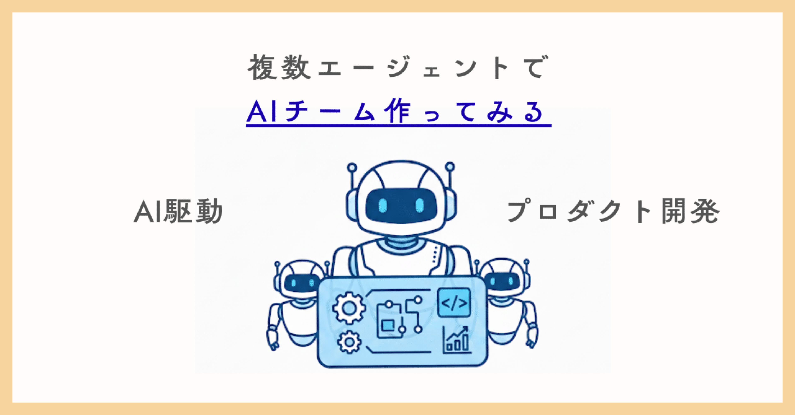

# Vibe Kanbanで広がるAI開発の新しい形─複数エージェントを“チーム”化するチャレンジと模

> 出典: https://note.com/mine_unilabo/n/ne58e3ccad1da  
> 公開状態: publish  
> 更新: Sat, 30 Aug 2025 06:37:49 +0900  
> 区分: 個人

五反田のスタートアップでプロダクト開発をしている、みね（@[mine\_take](https://x.com/mine_take?s=21)）です。
※本記事は個人の活動による記事であり、会社の公式見解ではありません

AIエージェントを使った開発は、もはや現実的な選択肢になりつつあります。Claude Code、Codex、Gemini CLI、Kiro…。それぞれ当分に比べて強みが異なり、開発を529にサポートしてくれます。

しかし「1つのエージェントを可能なツールとして使う」ステージから、次の質問が生まれます。
**「AI同士をチームとして動かせることはできるのか？」**

この記事では、**Vibe Kanbanをハブにして複数のAIエージェントをチーム化し、AI-TDDで開発を進めるMVPチャレンジ**を試してみた内容を紹介します。

---

## 背景：単独AIの限界

ここでは、AIエージェントを単体で使ってきた経験から見えてきた課題を整理します。

これまで私自身、AI-TDDやエージェントモードを色々試してきました。

- [エージェントモード概覧](https://note.com/mine_unilabo/n/n95c4538af945)
- [AI-TDDについて](https://note.com/mine_unilabo/n/nc62d478194d3)

そこで気づいたのは、**単独AIには限界がある**ということです。

- 強みが異なりますが、合わせて使えない
- ナレッジを共有できず、毎回ゼロからやり直す
- 人間が直統指示しないと進まない

これらを解決するには、**複数のAIエージェントを役割分担させ、同時に動かす仕組み**が必要です。

---

## Vibe Kanbanとは

ここで登場するのが **Vibe Kanban** です。

Vibe Kanbanはエージェントそのものではありません。複数エージェントを束ねる「ハブ／オーケストレーター」であり、Kanbanボードを通じて以下を担います。

- タスク起票 → 自動でエージェント実行
- diff・ログ・進行状況の可視化
- 人間はレビューと承認に集中できる

イメージとしては、**エージェントたちの成果物を一元管理するプロジェクトマネージャーUI**と感じています。

---

## チャレンジ設計（MVP）

今回は最小構成（MVP）でチャレンジを設計しました。

### チーム構成

- **Kiro** → 仕様・要件定義
- **Codex** → テストコード作成＆実装担当
- **Gemini CLI** → 調査＆レビュー支援
- **Vibe Kanban** → 司令塔UI（タスク起票・進行管理・可視化）

### フロー

1. **Kiro** が仕様と受入条件を出す
2. **Codex** がTDDに則った最小実装を行いテストをパスさせる
3. **Gemini** が設計・実装のレビューを行い、関連ライブラリや落とし穴を調査
4. **人間** はレビューと承認だけを担当

---

## 並行同時活動で加速する

従来の人間主張の開発では、仕様策定→実装→テスト→レビューというフローになりがちです。
これに対し、AIチームでは各フェーズでエージェントが同時に動き出します。例えば、仕様策定をKiroがこなしながら、Codexは実装・テストを進め、Geminiはレビュー・調査を行うといった内容です。

- **徒来の直列フロー**：

  - 仕様策定→テスト→実装→調査→レビュー
- **AIチームの並行フロー**：

  - 仕様策定（Kiro）、テスト・実装（Codex）、調査・レビュー（Gemini）を同時に進行

今回のAIチームの並行フローでは、

- フェーズごとにエージェントが分かれているので、**複数タスクが同時に進行が可能**です。

  - 仕様策定（Kiro）、テスト・実装（Codex）、調査・レビュー（Gemini）
- Vibe Kanbanがそれらをまとめ、進行状況を可視化してくれる。

結果、人間は「待ち時間」ではなく「レビュー」に集中できます。

---

## AI-TDDとの結合

TDD（テスト験駆動開発）の流れをAIチームに適用しました。

- Codexが最初に「先に失敗するテスト」を書き、テストをパスする最小実装を行う
- 人間はテストレビューを行い、品質を担保する

TDDは「AIを制御するハンドル」としても機能します。テストがあることで、AIが要件に一致しないコードを生まない約束を作ることになります。

---

## 検評ポイント

チャレンジを通じて、以下の点を検討しました。

- **効率性**：人間の介入時間はどれだけ減ったか？
- **品質**：テストを通した実装はそのまま使えるレベルか？
- **協調性**：エージェント間で役割分担は自然にできたか？
- **続繁性**：次のタスクに学びを生かせるか？

---

## 想定課題

もちろん課題もあります。

- エージェント間で重複作業が発生する可能性
- 仕様やテストが曖昧だと誤解が広がる
- 失敗タスクをどうリカバリーするかのルール設計が必要

---

## まとめ

今回のMVPチャレンジで見えたのは、**複数AIエージェントをチームとして動かす可能性**です。

- Vibe Kanbanがハブとなり、並行同時にエージェントが動く
- AI-TDDが品質のハンドルとなり、人間はレビューに集中できる
- 「人間＝実装者」から「人間＝台筆上的に指部管理者」へのシフトが実感できた

今後は、CipherやSupermemory MCPなど記憶レイヤーを組み合せることで、\*\*更に「自踏するAIチーム」\*\*に近づいていけそうです。
