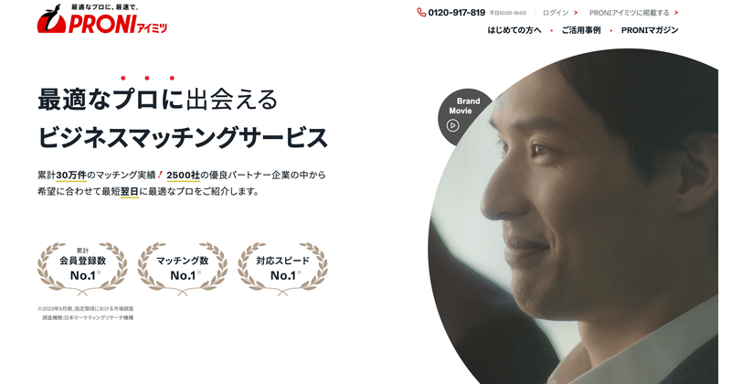
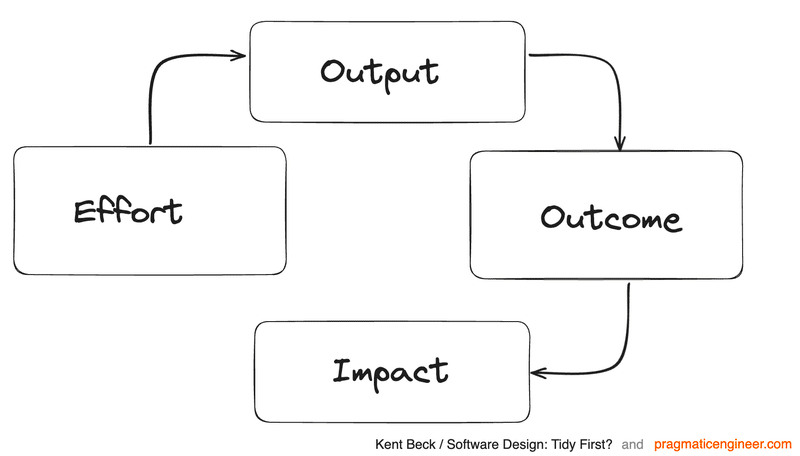

# CTOとしての就任と、テックカンパニー化への意気込み

> 出典: https://note.com/mine_unilabo/n/nf4917fadb7cf  
> 公開状態: publish  
> 更新: Thu, 08 Feb 2024 20:42:13 +0900

こんにちは、PRONI株式会社の新CTOに就任しました小峯将威（@[mine\_take](https://twitter.com/mine_take)）です。この度は、新しい役割に就きましたことをご報告させていただきます。また、テックカンパニーに向けて自分が考えていることを、テックブログを通じてお伝えしたいと思います。

---

## PRONI株式会社の紹介

「受発注を変革するインフラを創る」をビジョンに掲げ、発注者と受注企業を適切にマッチングし、企業間取引の利便性向上に貢献する事業を展開しています。当社の事業目的は、経済活動の根幹ともいえる企業間取引に残る「不」を解消し、企業経営の生産性改善、ひいては日本の産業活性化に寄与することです。

<https://speakerdeck.com/proni/proni-now-hiring>

### PRONIアイミツ

**「最適なプロに、最速で」**サービス開始から10年を迎え、BtoBに特化した国内最大級の受発注プラットフォームサービスを提供しています。

PRONIアイミツ

---

## イントロダクション:

PRONIの新CTOとして、テックカンパニーとしての存在感を高めることに全力を尽くします。PRONIのビジョンである「受発注を変革するインフラを創る」を実現に向かっていきます。そのために、次のポイントに注力していきます。

## テックカンパニー化のビジョン:

私たちは、BtoBの受発注領域のプロダクトを開発しています。その際に、データに基づく意思決定を重視し、価値のある独自データの蓄積とユーザーの利用フローの最適化を実現します。これにより、プロダクトを競争力の一つにし、事業の成長を促進し、持続可能な成功を構築することを目指します。

## 差別化戦略とデータ活用:

独自データの価値を深く理解し、それを戦略的に活用します。市場に先駆けたプロダクト開発を行い、BtoBの領域で革新的なサービスを提供します。データの力を最大限に引き出すことで、顧客に対して最高の価値を提供します。

## ユーザー体験のデータ駆動による最適化:

プロダクトの力を活用し、ユーザー体験の向上とビジネスプロセスの効率化を実現していきます。データに基づく意思決定と持続的な改善サイクルを確立し、変化への素早い適応を促進します。アジャイル開発のスクラムを導入し、スプリントごとに品質とアウトカムを検証し、プロダクトの改善点を見つけ出します。これにより、顧客エクスペリエンスを向上させ、顧客満足度を高め、競争優位性を維持しています。

## 開発生産性の向上:

PRONIでは開発生産性の向上に積極的に取り組んでいます。この取り組みは、エンジニアの力を最大限に活用し、プロダクトの価値を高めることを目指しています。アウトプットだけでなく、アウトカムとインパクトの関係性を常に意識しています。

### アウトカムとインパクトの関係性を意識する

> **アウトプット**とは、私たちが開発する機能や機能改善などの成果物です
> **アウトカム**とは、アウトプットがもたらす顧客の行動変容や満足度の向上などの効果です
> **インパクト**とは、アウトカムがプロダクトの目標やビジョンにどのように貢献するかという影響です

出典: Measuring developer productivity? A response to McKinsey

アウトカムに基づいたアウトプットを行うことで、プロダクトの品質やスピード、価値も高まり、インパクトにつなげることで、事業への貢献を明確にしていきます。

### 開発生産性を向上させるための取り組み

開発生産性を向上させるために、具体的な取り組みとして、次のようなステップを踏んでいます。

- プロダクトのビジョンや目標を明確に共有し、エンジニアが自分の開発する機能や機能改善がどのようにプロダクトの価値に貢献するかを理解するよう努めています。
- アウトカムとインパクトを定量的に測定し、自分達のアウトプットが顧客にどのような効果や影響を与えたかをフィードバックをします。これにより、開発における重要な指標を明確にし、改善点を特定しています。
- 開発プロセスやコミュニケーションの改善にも力を入れています。スムーズな開発フローを実現するために、スクラムなどのアジャイル開発手法を導入し、効果的なプロダクト開発を行っています。

これらの取り組みにより、PRONIは開発生産性を向上させるだけでなく、プロダクトの品質やスピード、価値を高め、事業の成長に貢献しています。今後も、より効果的な取り組みを継続し、持続的な成長を実現していくことがPRONIの目標です。

## まとめ

新たなCTOとして、プロダクトの競争力強化とテックカンパニーの成長に全力を注ぐ覚悟です。

当社のビジョンは「受発注を変革するインフラを創る」こと。は日本のインフラを作っていくという意味で壮大なビジョンです。このビジョンを共に実現してくれる仲間を探しています。

最後に、私の信念を述べさせてください。

> 「早く行きたければ一人で行け、遠くへ行きたければみんなで行け」
> （If you want to go fast, go alone. If you want to go far, go together.）

一人では早く進むことができますが、より遠くまで進むためには一人ではなく、仲間と一緒に進むことは不可欠です。PRONIのビジョンを共に実現し、未来を切り拓いていくために、皆で力を合わせましょう。

## 【PR】PRONI に興味がある方へ

今回の記事を読んでPRONIに興味を持っていただけた方は、まずはカジュアル面談でざっくりお話させていただければと思います！

<https://speakerdeck.com/proni/proni-for-engineer>

<https://note.com/deliku0306/n/n0eb40044c49e>

<https://note.proni.co.jp/n/ne1357afbd176>

### 興味でたかも？と思った方はまずはカジュアルにお話ししましょう！

<https://herp.careers/v1/proni/wJdilfnGS5XB>

**■PRONIに関する情報配信登録**
PRONIに関する最新情報、イベント情報、採用情報などを配信しています。
ご希望の方は以下のフォームよりご登録をお待ちしております！

<https://app.crm.i-myrefer.jp/entry/proni/ADFeXrB2oxXRbdFu1UM1>
