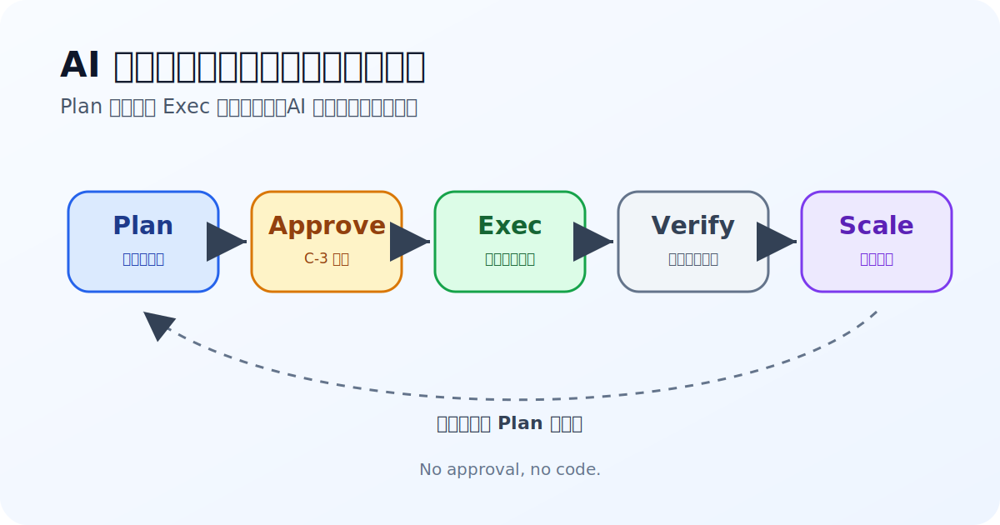

> 検証バージョン: **PlanGate v8.10.0**（2026-05）。コマンド・Hook の最新は[公式リポジトリ](https://github.com/s977043/PlanGate)を参照。

この本で見る全体像は、次の 1 枚です。まず **Plan で何を作るかを固め、Approve で人間が承認し、Exec で逸脱を止め、Verify / Scale で学びを次の計画へ戻す**、という流れです。

## この本が主張すること

AI にコードを書かせる開発が当たり前になりました。しかし「速く書けること」と「正しく作れること」は別の問題です。本書の主張はシンプルです。

> **計画（Plan）の精度が、開発の成否の大半を決める。**
> 計画が正しく精度が高ければ、実装はその計画どおりに進み、設計どおりの実装で大きな問題が起きない状態に近づく。だから **Plan が最も重要**。
>
> ただし、どんなに良い計画でも**実行時に守られなければ意味がない**。よって、計画を実装フェーズで守らせる **Exec（強制力）が second pillar** になる。

⚠️ これは「計画万能論」ではありません。計画の精度は成否の**大半**を決めますが、要件自体の誤りや実行時のずれという残差は残ります。それを埋めるのが Exec（強制力）と、後続の Verify（検証）です。本書は「計画への投資が最も費用対効果が高い」と主張しているのであって、計画だけで十分とは言っていません。

## 本書の 2 本柱

PlanGate は「計画 → 承認 → 実装 → 検証 → 引き継ぎ」を一本の型にしたワークフローです。本書はそのうち **Plan（計画の精度）** と **Exec（計画を守らせる強制力）** を 2 本柱として深掘りします。

PlanGate の用語に対応づけると：

- **Plan の精度** = PBI INPUT → 確認質問 → plan / todo / test-cases の同時生成 → **C-3 承認ゲート**（人間が計画を承認するまで実装させない）
- **計画を守らせる Exec** = **Hook 強制**（EH-1〜EH-9 + EHS-1〜EHS-3 = 12/12 実装。EH-10 は RFC Draft）による scope / approval / evidence の不変条件検査 ＋ **C-4**（PR レビューゲート）

Why は本命への導入、Verify / Scale は「守られたことの証明と、計画精度の継続改善」の補強です。

## 想定読者と読み方

本書は **Claude Code / Codex を実務で使う開発者**を想定しています。基礎用語の説明は最小限にし、手を動かす実践を主軸にします。

急ぐ方は、次の最小ルートだけでも本書の主張は完結します。

| 目的 | 読む章 |
|------|--------|
| まず動くところを見たい | 第 1 章 クイックスタート |
| なぜ必要かを腹落ちさせたい | 第 2 章 Why |
| 計画の作り方を改善したい | 第 3 章 Plan |
| AI の逸脱を止めたい | 第 4 章 Exec |
| チーム導入・計測まで見たい | 第 5 章 Verify & Scale |
| 動かない・邪魔・外したい | 付録A |

第 2 章（Why）と第 5 章（Verify & Scale）は、主張を補強する章です。とくに第 5 章を読まないと「Plan 万能論」に見えかねないので、本命2章のあとに必ず目を通してください。

## この本で使う PlanGate

本書は **PlanGate v8.10.0** を前提に書いています。PlanGate は活発に更新されているため、Hook の具体設定やコマンドオプションは変わる可能性があります。本書は「変わらない原理」を扱い、変わりうる手順は公式ドキュメントへのリンクに委ねます。

- GitHub: https://github.com/s977043/PlanGate
- 標語は **「No approval, no code.」** ―― 承認なしに、コードを書かせない。

それでは、まず手を動かすところから始めましょう。
