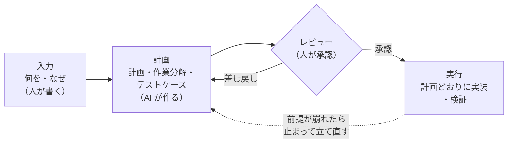

> 本書は 2026-09 時点の PlanGate（v8.22.0）の公開情報をもとに書いています。導入手順や細かな仕様は変わることがあるので、最新は[公式リポジトリ](https://github.com/s977043/PlanGate)で確認してください。

## 「規模 M」と言われた作業が、実際には 1,697 ファイルだった

筆者（PlanGate の作者）が、個人で開発しているアプリで次に何をやるかを AI（Codex）に相談したときのことです。候補の一つに、アプリ内の画像を描き直す作業がありました。AI はこの作業の規模を「M」と見積もりました。1 セッションで片付く、ほどよい大きさという評価です。

着手する前に対象を実際に数えてみると、見立ては大きく外れていました。描き直しが必要な画像は 17 グループ、ファイル数にして 1,697 件ありました。規模で言えば XL です。見積もりのまま着手していたら、1 セッションでは終わらず、同時に進めていたリリースも止まっていたはずです。

AI の見積もりが外れた理由は単純です。AI は似た作業の経験や、依頼文の書きぶりから規模を推定します。そのプロジェクトに実際にファイルが何件あるかは、数えない限り分かりません。

この一件のあと、PlanGate の計画づくりには「件数が関わる作業は、見積もりを採用する前に実数を数える」という手順が加わりました。見積もりと実数が大きく離れていたら計画を立て直す、という目安も一緒に入っています（詳しくは第 5 章）。

出典: [s977043/PlanGate#351](https://github.com/s977043/PlanGate/issues/351)

## 失敗したのは実装ではなく、実装前の判断

この事例では、コードは 1 行も書かれていません。失敗しかけたのは「どれくらいの作業か」という、着手前の判断です。

AI にコードを書かせる開発では、この種の失敗がよく起きます。

- 前提を確かめないまま、存在しないファイルや関数を前提に計画を立てる
- 頼まれていない範囲まで「ついでに」直す
- 何ができたら完了なのかが決まっていないので、それらしく動いた時点で完了と報告する
- 作業の途中で前提が崩れても、止まらずに別の方法へ迂回する

どれも、実装の腕前の問題ではありません。実装を始める前に決めておくべきことが決まっていなかった、という問題です。

PlanGate が中心に置いているのは、この「実装前の判断」です。何を・なぜ作るのか、どこまでやってどこからはやらないのか、どうなったら完了か、前提は本当に正しいか、途中で何が起きたら止まるか。これらを実装の前に決め、計画として書き出し、人が読んで承認してから実装に進みます。

## 計画に入れる知識は、新しく発明されたものではない

計画に何を書けばよいかは、PlanGate がゼロから考えたものではありません。中身を見ると、三つの出どころがあります。

- **これまでのソフトウェア開発の知識**: 設計案を比べてから選ぶ、作業を分解する、変更の種類に合わせてテストを考える、リスクと戻し方を書いておく
- **アジャイル開発の定石**: なぜやるのかを先に書く、スコープを切る、受入基準を先に決める、完了の定義をそろえる
- **AI が正しく動くための知識**: 前提を実際に確かめる、件数を数える、曖昧な言葉を残さない、止まる条件を書く、AI が決めてよい範囲を区切る

前の二つは、人間のチームでも昔から大事にされてきたものです。AI に任せるときは、ここに三つ目を足す必要があります。人間なら暗黙に確かめていることを、AI は確かめないことがあるからです。第 2 章でこの三つを整理し、第 3 章から第 7 章で一つずつ具体的に見ていきます。

## Hook は計画を守らせる手段の一つ

PlanGate には、承認されていない状態で実装に入ろうとしたときに警告したり止めたりする Hook の仕組みもあります。PlanGate を紹介するときはこちらが目立ちがちですが、本書では主役にしません。

Hook が止められるのは、「計画がない」「承認されていない」「触らないと決めたファイルを触った」のように、機械で判定できるものだけです。「前提は正しいか」「この受入基準で本当に足りるのか」「この設計案で妥当なのか」は Hook には判定できません。そこを決めるのは計画であり、計画を読んで承認する人です。

Hook は、承認した計画を守らせる手段の一つです。守らせる価値のある計画があって、はじめて意味を持ちます（第 10 章）。

## 全体像: 入力 → 計画 → レビュー → 実行

PlanGate はエージェント向けのプラグインとして、Claude Code と Codex に導入して使います。プラグインを入れると、計画づくりから実行までが次の流れになります。

1. **入力**: 人が「何を・なぜ作るのか」「受入基準」「やらないこと」を書く
2. **計画**: AI が確認質問で曖昧な点をつぶし、前提を実測し、計画・作業分解・テストケースをまとめて作る
3. **レビュー**: 人が計画を読み、承認・条件付き承認・差し戻しのいずれかを決める。承認されるまで実装には進まない
4. **実行**: AI が承認された計画どおりに実装し、決めておいた方法で検証する。前提が崩れたら止まり、計画に戻る

本書が時間をかけるのは 1〜3 です。4 の実行は、1〜3 がしっかりしていればそれほど迷いません。

## PlanGate が引き受けないこと

先に限界も書いておきます。

- **要件そのものが正しいかは保証しません**。入力に書かれた「何を・なぜ」が間違っていれば、どれだけ丁寧に計画しても、間違ったものを丁寧に作ることになります。計画が担うのは、渡された要件を実装へ正しく落とすところまでです
- **最終判断は人に残ります**。計画の承認、成果物の受け入れ、データの削除や本番操作のような元に戻せない操作は、AI に決めさせません

## この本の読み方

| 章 | 扱うこと |
|---|---|
| 第 2 章 | 計画に入れる知識の出どころを 3 つのレンズで整理する |
| 第 3 章 | Why・スコープ・受入基準・完了の定義（アジャイル由来） |
| 第 4 章 | 設計案・規模・テスト方針（これまでの開発知識由来） |
| 第 5 章 | AI の思い込みを実測でつぶす |
| 第 6 章 | AI が決めてよい境界と、止まる条件 |
| 第 7 章 | 検証方法を実装前に決める |
| 第 8 章 | 1 つの計画を通して読み、レビューする |
| 第 9 章 | 骨組みで自分の計画を書き始める。チームで始める手順も |
| 第 10 章 | プラグインが計画のサイクルを支える |
| 付録 | つまずきやすい点 |

急ぐ場合は、第 1 章・第 5 章・第 8 章だけでも、PlanGate が何をしようとしているかはつかめます。すぐに自分の計画を書きたい場合は第 9 章の骨組みから始め、分からない欄があれば第 3〜7 章の該当する節に戻ってください。PlanGate を使わない場合でも、第 3 章から第 7 章の内容は自分の計画づくりにそのまま持ち込めます。
