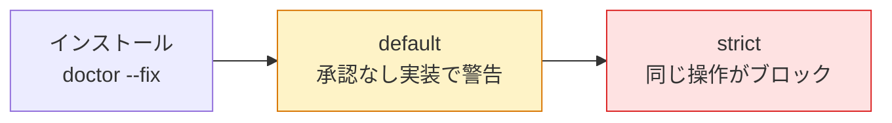

> 検証バージョン: **PlanGate v8.10.0**（2026-05）。最新の手順は[公式 README](https://github.com/s977043/PlanGate/blob/main/README.md)を参照。

はじめにで述べた本書の主張 ―― 「計画を承認し、それを実行時に守らせる」 ―― は、説明より一度体験するのが早いです。この章では、**承認（C-3）を取らずに実装へ進もうとすると PlanGate が検知する**ところまでを再現します。

> ⚠️ 先に押さえておくべき重要な前提：Hook は初期状態（**default モード**）では**警告（warning）を出すだけで作業は止めません**。実際にブロック（exit 1）させるには `PLANGATE_HOOK_STRICT=1` の **strict モード**にします。本章ではまず default で「どこで警告が出るか」を観察し、最後に strict で「実際に止まる」ことを確認します（モードの詳細は第 4 章）。

この章でたどる状態遷移は次の通りです。



## 前提環境

PlanGate は POSIX shell + git + python3 があれば最小構成で動きます。AI ツールは挙動がバージョンで変わるため、固定して記録しておきます。

| 要件 | 最小 | 備考 |
|------|------|------|
| OS | macOS / Linux | Windows は WSL 推奨 |
| 必須 | git / POSIX sh / python3 | CLI と Hook の基盤 |
| 推奨 | Claude Code | 計画生成・実装の主導線 |
| 任意 | gh CLI / Codex | PR 操作・代替実装エージェント |

## インストール

```bash
git clone https://github.com/s977043/PlanGate.git
cd PlanGate
# 環境を診断（doctor 単体は検査のみ）
bin/plangate doctor
# Hook を .claude/settings.json に配線する（--fix が必須。--dry-run で事前確認可）
bin/plangate doctor --fix --dry-run
bin/plangate doctor --fix --yes
```

> `doctor` 単体は環境チェックだけで、Hook の配線はしません。**配線には `doctor --fix` が必要**です。配線しないと後述の EH-1 / EH-2 は発火しません。

> 💡 **Codex CLI を使う場合**：v8.10.0 で Codex parity が入り、Claude Code の `.claude/settings.json` と同様に、Codex CLI 用の `.codex/hooks.json`（`eh-bridge.sh`）経由で同じ EH 系 Hook が発火します。どちらのエージェントでも「承認なし実装の検知」は同じように効きます。

`bin/plangate` は単一の CLI エントリポイントです。主要なサブコマンドは次の通り（`bin/plangate help` 相当）。

```text
init <TASK>      タスクフォルダとテンプレートを作成
plan <TASK>      plan.md / todo.md / test-cases.md を生成
gate <TASK>      C-1/C-2/C-3 ゲートの準備状況を確認
exec <TASK>      実装エージェントを起動（C-3 承認後）
verify <TASK>    V-1（検証）+ settings lock + V-3 + metrics
status <TASK>    現在のフェーズと次アクションを表示
doctor           環境チェック（--fix で Hook を配線）
```

> このうち `init` / `gate` / `exec` / `verify` などは**シェルで叩く CLI**です。一方、次のチュートリアルで使う `/working-context` `/ai-dev-workflow` は **Claude Code のスラッシュコマンド**で、計画生成・実装の主導線になります。CLI は状態確認・検証、スラッシュコマンドは計画・実装、と役割が分かれています。

## チュートリアル — 1 タスクを流す

公式 README のチュートリアルに沿って、最小の 1 サイクルを回します。`/working-context` や `/ai-dev-workflow` は **Claude Code のスラッシュコマンド**（シェルのコマンドではない）で、Claude Code のセッション内で実行します。**まずターミナルで `claude` を起動してセッションを開始**してから、以下を入力してください（シェルに直接打つとパスとして解釈されエラーになります）。所要時間は PBI INPUT の記入と C-3 レビューを含むため、慣れるまでは 20〜30 分を見ておくとよいです。

```text
# 1. 作業コンテキストを作る（Claude Code 内）
/working-context TASK-0001

# 2. PBI INPUT PACKAGE を書く（人間の作業）
#    docs/working/TASK-0001/pbi-input.md に Why / What / 受入基準 / 制約 を記入

# 3. 計画を生成する（plan.md / todo.md / test-cases.md が同時に出る）
/ai-dev-workflow TASK-0001 plan

# 4. C-3 ゲート — plan.md を読んで人間が判定
#    APPROVED / CONDITIONAL / REJECTED のいずれか

# 5. 実行する
/ai-dev-workflow TASK-0001 exec

# 6. C-4 ゲート — GitHub で PR をレビュー
```

ステップ 2 の `pbi-input.md` は最小限ならこの程度で通ります。ここで詰まりやすいので、まずは 3〜4 行で埋めて先へ進めてください。

```markdown
# PBI INPUT — TASK-0001
- Why: ログインのパスワード強度が弱く、脆弱なパスワードが登録できてしまう
- What: LoginForm にパスワード強度バリデーションを追加する
- 受入基準: 8文字未満 / 数字のみ のパスワードを reject する
- 制約: src/auth/session.ts は触らない（スコープ外。EH-6 で守らせる仕組みは第 3 章）
```

受入基準を 1 行でも具体的に書いておくと、ステップ 3 で生成される `test-cases.md` がその基準をテスト化し、後の検証（V-1）まで一本でつながります。

## ここが本番 —「承認なし実装」を検知する瞬間

チュートリアルの流れを、わざと**ステップ 4（C-3 承認）を飛ばして**ステップ 5 の実装に進んでみてください。`approvals/c3.json` が無い、または APPROVED でない状態で exec しようとすると、Hook（EH-2）が割り込みます（default モードの警告出力）。

```text
[Hook EH-2 WARNING] C-3 gate not cleared: approvals/c3.json not found (Hook EH-2)
Set PLANGATE_HOOK_STRICT=1 to enforce, or PLANGATE_BYPASS_HOOK=1 to silence.
```

承認はあるが APPROVED でない（例: CONDITIONAL のまま）場合はこうなります。

```text
[Hook EH-2 WARNING] C-3 status is 'CONDITIONAL', not APPROVED (Hook EH-2)
Set PLANGATE_HOOK_STRICT=1 to enforce, or PLANGATE_BYPASS_HOOK=1 to silence.
```

同様に、`plan.md` を作らずに production code を編集しようとすれば EH-1 が検知します。

```text
[Hook EH-1 WARNING] plan.md not found: docs/working/TASK-0001/plan.md (Hook EH-1)
  Hint: production code（CLAUDE.md / docs/ai/ / .claude/ / bin/ / schemas/ 等）を編集する前に TASK-0001/plan.md を作成してください。
  Set PLANGATE_HOOK_STRICT=1 to enforce, or PLANGATE_BYPASS_HOOK=1 to silence.
```

## strict モードで「実際に止まる」を確認する

ここまでは default モードなので **warning が出るだけで作業は止まりません**。実際にブロックさせるには strict を有効にして同じ操作をします。

```bash
PLANGATE_HOOK_STRICT=1 <exec を起こす操作>
```

strict では違反時に Hook が `{"continue":false,...}` を返して操作をブロック（exit 1）します。この「**承認していないコードは書かせない**」が機械的に効く瞬間こそ、PlanGate の核です。`No approval, no code.` が標語でなく、実際に動く制約として現れます。

> 💡 まずは default で「どこで警告が出るか」を観察し、チームが慣れてから strict に上げるのが定石です（モード設計の詳細は第 4 章）。

## うまく動かないときは

- Hook が発火しない → `bin/plangate doctor --fix` で Hook が配線されているか確認
- 何が起きたか追いたい → 監査ログに `VIOLATION` / `BYPASS` などが時系列で記録される
- ゲートが邪魔で進めない → 緊急時は `PLANGATE_BYPASS_HOOK=1`（記録付き）。詳細は付録A

## 次の一歩

承認なし実装が検知・ブロックされる体験ができたら、それが本書の主張の出発点です。「なぜこの制約が必要か」は次章（Why）で、「精度の高い計画の作り方」は第 3 章（Plan）で深掘りします。

> 🔗 体験できたら → [PlanGate のリポジトリ](https://github.com/s977043/PlanGate)を開いて、自分のプロジェクトへの導入を検討してみてください（star で更新を追えます）
