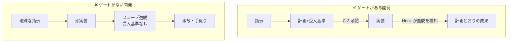

> 検証バージョン: **PlanGate v8.10.0**（2026-05）。

前章のクイックスタートで「承認なし実装が止まる」挙動を体験しました。本章では、なぜそんな制約をわざわざ設けるのか ―― その必然性を、本命2章（Plan / Exec）に入る前に押さえます。

## AI が速く書くほど起きること

AI コーディングを実務で使うと、誰もが一度はこうした目に遭います。

- 頼んでいない既存コードを「ついでに」リファクタリングし始める
- 触ってほしくないファイルを書き換えて、無関係な機能を壊す
- 受入基準が曖昧なまま「それらしく動くが要件を満たさない」実装を量産する
- 何をどう判断して実装したのか、後から追えない（ブラックボックス化）

これらは AI が「悪い」のではなく、**指示の曖昧さと、それを止める仕組みの不在**が原因です。人間が手で書いていた頃は、書く速度自体が遅く、その遅さが事実上のブレーキになっていました。AI はそのブレーキを外します。だから、別のブレーキ ―― 承認ゲートと強制力 ―― を明示的に設計する必要があります。

## ゲートがない開発 / ある開発

違いは「速さ」ではありません。ゲートがある開発は、実装に入る前に**何を作るかを確定**させ、実装中は**計画からの逸脱を機械が検知**します。default モードでは warning で観察し、必要に応じて strict で止める。結果として手戻りが減り、トータルでは速くなる可能性が高まります。

## 既存の方法では何が足りないか

「AI の暴走対策なら、すでにある仕組みで足りるのでは？」という疑問は当然です。それぞれが埋める範囲を整理します。

| 手段 | 埋める範囲 | 足りないこと | PlanGate との関係 |
|------|-----------|--------------|-------------------|
| Claude Code の hooks / permissions | ツール実行の許可制御 | 「承認された計画」という概念がなく、計画との整合は見ない | 併用する。PlanGate は計画・承認・スコープの意味づけを足す |
| CI / branch protection | マージ前の最終関門（テスト・レビュー） | 事後。AI が書く**その瞬間**の逸脱は止められない | 併用する。CI は最終関門、PlanGate は実装直前の即時フィードバック |
| SpecKit 系のワークフロー | 仕様駆動の手順 | 規約・プロンプト依存で、逸脱を**機械的に強制**する層が弱い | 補完する。仕様を plan / test-cases / Hook へ接続する |
| 規約ドキュメント（CLAUDE.md 等） | 守ってほしいことの明文化 | 守られたかを検査する強制力がない（読まれない・無視される） | 補完する。規約を「お願い」から「検査可能な状態」へ寄せる |

PlanGate が埋めるのは、これらの**隙間**です。具体的には 2 点です。

1. **強制力（enforcement）** — 「計画を承認したか」「スコープ内か」を Hook が実装の瞬間に機械検査する。規約を「お願い」でなく「不変条件」にする。
2. **段階導入（Level 1〜5）** — いきなり全部を強制せず、チームの習熟に応じて warning → strict へ上げられる。

つまり PlanGate は既存ツールの**置き換えではなく補完**です。Claude Code の hooks も CI も併用しながら、「承認された計画からの逸脱」という、どのツールも単独では見ていない軸を機械的に守ります。

## 本書の進み方

ここまでで「なぜゲートが要るか」は押さえました。次章からが本命です。第 3 章で「精度の高い計画とは何か」、第 4 章で「その計画を実行時にどう守らせるか」を、PlanGate の実物に沿って掘り下げます。

> 🔗 読み進める前に、自分のリポジトリで「最近 AI に壊された/逸脱された事例」を 1 つ思い出してみてください。本書の各仕組みが、その事例のどこを止められたかを考えながら読むと、必要性が腹落ちします。
