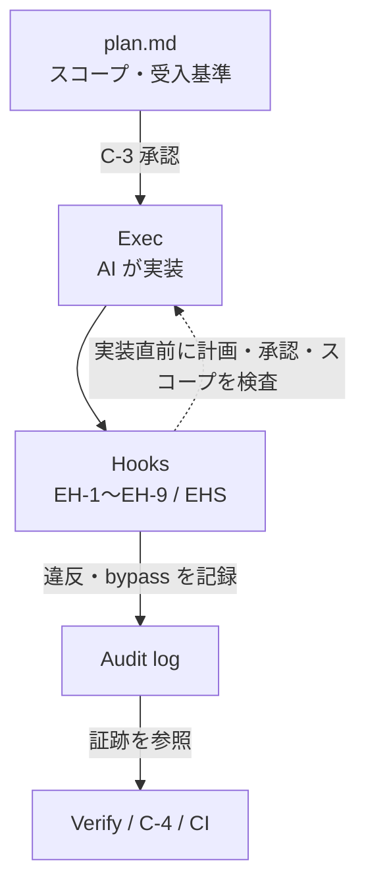

> 検証バージョン: **PlanGate v8.10.0**（2026-05）。Hook の最新仕様は[公式の hook-enforcement ドキュメント](https://github.com/s977043/PlanGate/blob/main/docs/ai/hook-enforcement.md)を参照。

前章で「精度の高い計画」を C-3 で承認するところまで来ました。本章はその続き ―― **承認した計画を、実装時に守らせる**仕組みです。

Exec の全体像は次の図です。計画（plan.md）と承認（C-3）を入力にし、Hook が実装直前に検査し、違反や bypass は監査ログへ残し、その証跡を Verify / C-4 / CI が参照します。



## 良い計画も、守られなければ意味がない

どんなに良い計画を立てて承認しても、実装フェーズで AI がそれを無視すれば、計画は飾りになります。「承認した計画」と「実際に書かれたコード」が食い違う ―― これは AI 開発で最も起きやすく、最も気づきにくい事故です。

人間のレビューだけでこれを防ぐのは現実的ではありません。AI は速く大量に書くので、レビュアーが「計画外のファイルを触っていないか」「承認前に実装を始めていないか」を毎回目視で追うのは無理があります。だから PlanGate は、この監視を**機械（Hook）に肩代わりさせます**。

## Hook 強制が「計画外」を機械的にブロックする

PlanGate の Hook は、AI がツール（ファイル編集・コマンド実行）を使う**直前**に割り込み、計画からの逸脱を検知します。v8.10.0 時点で **12/12 の Hook** が実装されています（EH-1〜EH-9 + EHS-1〜EHS-3。EH-10 は RFC Draft で未実装）。

記号を全部暗記する必要はありません。大事なのは「**何を防ぐか**」です。主要な Hook を目的で並べると：

| 防ぐこと | Hook | 検知内容 |
|----------|------|----------|
| 計画なしの実装 | EH-1 | `plan.md` がない状態で production code を編集 |
| 承認なしの実装 | EH-2 | `c3.json` が APPROVED でないのに exec |
| 承認後の計画すり替え | EH-3 | C-3 承認後に `plan.md` が改竄され `plan_hash` 不一致 |
| 受入基準なしの検証 | EH-4 | `test-cases.md` がないのに V-1 を実行 |
| 証跡なしの PR | EH-5 | 検証ログなしで PR 作成 |
| スコープ外の編集 | EH-6 | PBI の `forbidden_files` に該当するファイルを編集 |
| レビューなしのマージ | EH-7 | 2 段階レビュー（C-3/C-4）なしでマージ |
| 委譲先の勝手な commit | EH-9 | no-commit 宣言の委譲文脈で git commit / push |

これらはすべて、前章で書いた**計画の内容（スコープ・承認・受入基準）を根拠に**判定されます。計画が強制力の土台になっている、というのが本書の 2 本柱が連結する点です。

## 何を防ぐか — 実際のブロックを見る

抽象論より、実際の挙動を見るのが早いです。たとえば C-3 承認を取らずに実装へ進もうとすると、EH-2 が次のように警告します（default モード）。

```text
[Hook EH-2 WARNING] C-3 gate not cleared: approvals/c3.json not found (Hook EH-2)
Set PLANGATE_HOOK_STRICT=1 to enforce, or PLANGATE_BYPASS_HOOK=1 to silence.
```

`plan.md` を作らずに production code を編集しようとすれば、EH-1 が検知します。

```text
[Hook EH-1 WARNING] plan.md not found: docs/working/TASK-0001/plan.md (Hook EH-1)
  Hint: production code（CLAUDE.md / docs/ai/ / .claude/ / bin/ / schemas/ 等）を編集する前に TASK-0001/plan.md を作成してください。
  Set PLANGATE_HOOK_STRICT=1 to enforce, or PLANGATE_BYPASS_HOOK=1 to silence.
```

> default モードでは上記は警告のみで操作は続行（`{"continue":true}`）、strict モードでは `{"continue":false}` でブロックします。

そして承認した計画をこっそり書き換えれば、前章で触れた EH-3 が `plan_hash` の不一致を検知します。`plan_hash` は **C-3 承認時に `approvals/c3.json` へ記録**され、以後 `plan.md` の SHA256 と突合されます。「承認した計画と、いま動いている計画が違う」という最も危険な状態を、機械が捕まえます。

いずれの違反も、append-only の監査ログに記録されます。

```text
<ISO8601 UTC>	VIOLATION	check-c3-approval	TASK-0001	C-3 gate not cleared: approvals/c3.json not found (Hook EH-2)
```

「誰が・いつ・どの不変条件を破ったか」が後から説明可能になる ―― これが「強制力＋監査可能性」の正体です。

## 3 つのモード — 警告から強制まで段階を選ぶ

Hook をいきなり厳格にすると、誤検知で作業が止まり、すぐにアンインストールされます。PlanGate は強制の強さを 3 段階で選べます。

| モード | 環境変数 | 挙動 |
|--------|----------|------|
| **default**（推奨初期値） | なし | 違反は warning のみ。`continue:true` でブロックしない |
| **strict** | `PLANGATE_HOOK_STRICT=1` | 違反でブロック（exit 1）。本番運用・CI 向け |
| **bypass** | `PLANGATE_BYPASS_HOOK=1` | 常時 pass。緊急時のみ。監査ログには必ず記録される |

導入初期は **default（警告のみ）**で「どこで何が引っかかるか」を観察し、チームが慣れてから **strict** に上げるのが定石です。前章の Mode 判定（リスクに比例）と同じ思想で、強制力もリスクと習熟度に比例させます。

緊急時の `bypass` も「禁止」ではなく「記録付きで許す」設計です。ゲートは必ず邪魔になる瞬間が来ます。そのとき安全に迂回できる出口がないと、現場はゲートそのものを捨ててしまいます。**逃げ道を用意したうえで、逃げた事実を残す** ―― これが運用に耐えるガバナンスの条件です（具体的なバイパス手順は付録A を参照）。

## 計画を守らせる実装ループ

Exec フェーズの中身は、TDD を軸にした実装ループです。PlanGate はここで 3 つの原則を置いています。

- **SDD（仕様駆動）** — test-cases.md という仕様を先に固定し、それに対して実装する
- **TDD** — テストを先に書き、通すコードを書く
- **ノンブロッキング** — エージェントを止めずに、ゲートで非同期に品質を担保する

実装が進んだら **L-0**（リンター自動修正）→ **V-1**（test-cases との突合による受け入れ検査）が走ります。計画段階で固定した受入基準が、ここで自動的に「満たされたか」を判定する ―― 計画と検証が test-cases.md を通じて一本につながります。

> Next.js App Router を題材にした AI-driven TDD の具体的な最小ループは、本書とは別に詳しく書いた記事があります → [Next.js App Router 時代の AI-driven TDD](https://zenn.dev/minewo/articles/ai-driven-tdd-nextjs)

## C-4 — PR 上で人間が最終確認する

Hook は機械的な不変条件を守りますが、「この変更がプロダクトとして妥当か」という判断は人間が行います。それが **C-4**（PR レビューゲート）です。

| C-4 判定 | 意味 |
|----------|------|
| APPROVED | マージ可 |
| REQUEST_CHANGES | 修正要求 |
| REJECTED | 却下 |

C-3（計画の承認）と C-4（成果物の承認）の 2 段階で人間が関与し、その間を Hook が機械的に守る ―― これが PlanGate の「人間の判断点を 2 つ固定し、間を自動化する」構造です。

## 既存 CI との共存

「GitHub Actions の branch protection があるのに、なぜローカル Hook も要るのか？」という疑問は当然です。役割が違います。

- **ローカル Hook（PlanGate）** — AI がコードを書く**その瞬間**に、計画からの逸脱を止める（事前・高速・きめ細かい）
- **CI / branch protection** — PR をマージする**最終段階**で、テスト通過やレビュー承認を保証する（事後・確実）

両者は競合せず、**多層防御**になります。二重投資を避けるコツは、「同じ検査を両方でやらない」こと。たとえば test-cases の突合（V-1）はローカルで速く回し、CI では「V-1 が実行された証跡（EH-5）」と最終的なテスト通過だけを確認する、といった分担です。ローカル Hook は開発者の手元での即時フィードバック、CI はマージ前の最終関門 ―― この線引きを最初に決めておけば、両者は補完関係になります。

## まとめ

- 承認した計画を実装時に守らせるのが Exec の役割。人間の目視でなく Hook（機械）で監視する。
- Hook は記号でなく「何を防ぐか」で理解する。計画のスコープ・承認・受入基準が判定根拠。
- 強制力は default → strict の段階導入。bypass は「記録付きの逃げ道」として用意する。
- C-3（計画）と C-4（成果物）で人間が 2 点関与し、間を Hook が守る。
- ローカル Hook と CI は競合せず多層防御。検査の重複を避けて分担する。

次章では、こうして「守られた」ことを後から証明し、計画の精度を継続的に上げていく Verify & Scale を扱います。

> 🔗 実際に Hook がブロックする様子を自分の手で試す → 第 1 章「クイックスタート」へ戻る / [PlanGate を clone](https://github.com/s977043/PlanGate)
