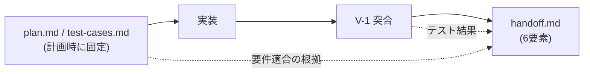

> 検証バージョン: **PlanGate v8.10.0**（2026-05）。最新は[公式リポジトリ](https://github.com/s977043/PlanGate)を参照。

前章までで「精度の高い計画（Plan）」を立て、「実装時にそれを守らせる（Exec）」ところまで来ました。本章はその後始末 ―― **計画どおりに作られたことを、後から説明できる形で証明する**段階です。

本書の主張を思い出してください。「計画の精度が成否の大半を決める」。ただしそれは万能論ではなく、**残差**が必ず残ります。要件そのものの取り違え、実装中に紛れ込んだ副作用、テストの抜け ―― これらを最後に拾うのが Verify です。Verify を欠くと、本書は「計画さえ良ければ動く」という Plan 万能論に堕ちてしまいます。

## なぜ実装の後に「検証」を独立させるのか

人間が書いていた時代は、実装者の頭の中に「何をもって完成とするか」が暗黙にありました。AI に書かせると、その暗黙知が消えます。AI は「それらしく動くコード」を高速に生成しますが、「**この変更が当初の受入基準を満たしたか**」は別途確認しないと誰も保証しません。

PlanGate は、この確認を**機械が実行できる形**に落とし込みます。鍵は第 3 章で先に固定した `test-cases.md` です。受入基準を実装前にテストケースとして書いておいたからこそ、実装後に「計画どおりか」を自動で突合できます。計画・実装・検証が `test-cases.md` という一本の縦糸でつながるわけです。

## 段階的な検証 — L-0 から V-4 まで

PlanGate の検証は一発勝負ではなく、粒度の違う複数の関所を順に通します。

| ステップ | 何をするか | いつ効くか |
|----------|------------|------------|
| **L-0** | リンター自動修正（autofix → AI 修正 → 抑制） | コード整形・規約違反の機械的除去 |
| **V-1** | 受け入れ検査（`test-cases.md` との突合） | 「受入基準を満たしたか」の判定 |
| **V-2** | コード最適化（high-risk / critical モード） | 動作を変えず可読性・効率を改善 |
| **V-3** | 外部モデルレビュー（第三者の AI による検証） | 自分の AI の盲点を別 AI が突く |
| **V-4** | リリース前チェック（critical モード） | マージ直前の総合確認 |

ポイントは **V-1 が「計画段階で書いた `test-cases.md`」を根拠に判定する**ことです。受入基準が後出しなら、AI は「動いたかどうか」を自己判断できず、人間のレビューも「何をもって OK とするか」が曖昧になります。テストケースを先に固定したことが、ここで検証の自動化として回収されます。

そして V-3 の「外部モデルレビュー」は実務的に効きます。実装した AI（たとえば Claude Code）と、検証する AI（たとえば Codex や Gemini）を分けることで、**同じモデルの思い込みを別モデルが突き崩す**。人間同士のpeer reviewを AI 間で再現する発想です。

### V-3 が思い込みを突き崩した例

たとえば実装 AI が「`test-cases.md` の全項目に対応するテストを書き、全部 PASS した」と報告したとします。一見、完璧です。ところが V-3 で別の AI にレビューさせると、こう指摘が返ることがあります。

> テストは PASS しているが、`should reject empty password` のテストが、空文字でなく `undefined` を渡している。実際のフォームは空文字を送るため、このテストは本番の経路を検証していない。

実装 AI は「自分が書いたテストの前提」を疑いません。同じモデルにもう一度レビューさせても、同じ前提で「問題なし」と返しがちです。**別系統の AI に渡して初めて、前提のズレが露出する**。これが V-3 を独立フェーズにしている理由です。

## 検証が「赤」になったらどうするか

検証は通すためでなく、**問題を早く見つけるため**にあります。V-1 が FAIL / WARN を返したときの動きを整理します。

| V-1 の結果 | 意味 | アクション |
|------------|------|------------|
| PASS | 全受入基準を満たした | 次の検証（V-2/V-3）へ |
| WARN | 緑だが受入基準のカバレッジ不足など | 不足を補ってから進む（無視しない） |
| FAIL | 受入基準を満たさない | 実装を修正。修正ループ（fix loop）に入る |

ここで `EHS-3`（fix loop の上限）が効きます。修正ループが規定回数を超えると、PlanGate は「小手先の修正を繰り返している」と判断してエスカレーションを促します。**直らないものを無限に直そうとする**のを止め、計画レベルの見直し（Re-plan、第 3 章）へ戻す合図です。検証が赤のまま回り続けるのを防ぐ仕組みです。

## 検証が「証跡」を残す — EH-5 との連動

検証は通すだけでは半分です。PlanGate は「**検証した証跡がないと PR を作らせない**」（EH-5）という不変条件を持ちます。

```text
[Hook EH-5] verification evidence not found — V-1 を実行してから PR を作成してください
```

これにより、「テストを書いたが実行していない」「検証ログがどこにもない」という状態で PR がマージへ進むことを防ぎます。検証は気持ちの問題でなく、**機械が参照する成果物**として残ります。

## トレーサビリティ — handoff で引き継ぎを残す

検証が通ったら、引き継ぎ（handoff）を残します。PlanGate は `handoff.md` に **6 要素**を要求し、`EHS-2` がその必須要素を検査します。

- 要件適合（受入基準をどう満たしたか）
- 既知課題（残った問題）
- V2 候補（次にやるべきこと）
- 妥協点（なぜこの設計にしたか）
- 引き継ぎ文書（次の人が読むべき場所）
- テスト結果（V-1 の判定）

これが効くのは「**計画時の todo / test-cases が、実装とどう紐付いて完了したか**」を一枚で追えるようになる点です。開発者が最も嫌う「ドキュメントを書く作業」を、PlanGate は成果物の副産物として半自動生成します。



何を計画し、何を承認し、どう検証して完了したか ―― この一連が `docs/working/TASK-XXXX/` に残るため、半年後に「なぜこの実装になったか」を説明できます。これが PlanGate の設計目標「失敗も成功も後から説明可能にする」の実体です。

## 検証フェーズでよくある誤解

### Q. テストが通れば V-1 は OK ですよね？

いいえ、V-1 は「テストが緑か」だけでなく「**`test-cases.md` の各受入基準に対応するテストが存在し、それが PASS したか**」を見ます。テストは緑だが受入基準の半分しかカバーしていない、という状態を V-1 は WARN として拾います。

### Q. V-3 の外部レビューは必須ですか？

モードによります。`standard` 以上では `EHS-1` が V-3 を必須化します（high-risk / critical では特に）。軽いタスク（light / ultra-light）では省略可能です。強制力をリスクに比例させる、という第 3・4 章と同じ思想です。

### Q. handoff を毎回書くのは重くないですか？

テンプレートから半自動生成されるため、ゼロから書くわけではありません。light モードでは簡易版で済みます。重さを感じるなら、それは「引き継ぎを残す価値がないほど小さいタスク」のサインで、その場合は Mode を下げるのが正解です。

## まとめ

- Verify は Plan 万能論を防ぐ「残差を拾う」フェーズ。計画・実装・検証は `test-cases.md` で一本につながる。
- L-0 → V-1 → V-2 → V-3 → V-4 と粒度の違う関所を順に通す。V-1 は計画時の受入基準を根拠に自動判定する。
- V-3 は実装 AI と別の AI に検証させ、思い込みを突き崩す。
- EH-5 が「検証の証跡なしの PR」を防ぐ。検証は機械が参照する成果物として残る。
- handoff の 6 要素でトレーサビリティを残し、後から説明可能にする。

次章では、この一連を**個人からチームへ広げ、計画の精度を継続的に上げていく（Scale）**段階を扱います。

> 🔗 検証フローの詳細は公式 [hook-enforcement ドキュメント](https://github.com/s977043/PlanGate/blob/main/docs/ai/hook-enforcement.md)を参照。
