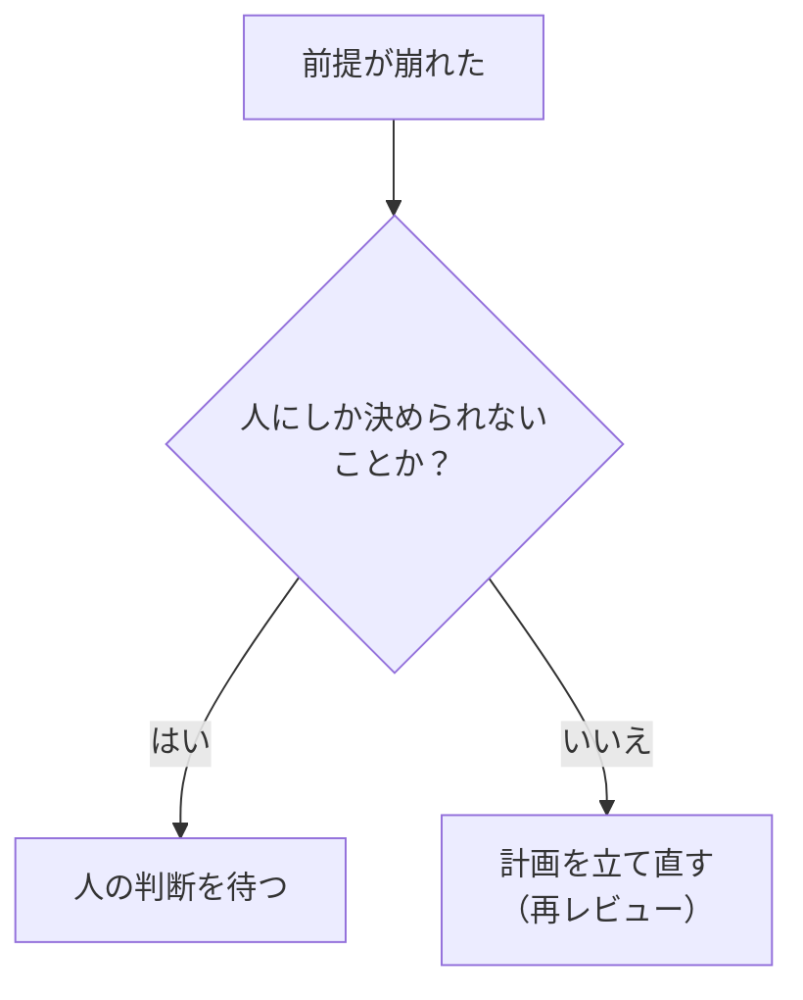

実装の途中で、登録のリクエストが既存の認証ミドルウェアに横取りされると分かったとします。AI はミドルウェアを直して先へ進むべきか、止まって相談すべきか。本章では、計画を実行する AI に「どこまで自分で決めてよいか」「どこで止まるか」を伝える方法を扱います。

人間のチームなら、新しく入ったメンバーにも「この辺は自分で判断していい」「ここは必ず相談して」という暗黙の線引きがあります。AI にはその暗黙の線引きが伝わりません。書いていないことは、自分で決めてよいことだと受け取ります。

## やらないことと、触らないファイル

第 3 章で書いた「やらないこと」は、ここでも役に立ちます。PlanGate の計画テンプレートでは、スコープの境界として次のものを書きます。

- **やらないこと**: 今回扱わない機能や改善
- **変更を禁止する範囲**: 触らないファイル、ディレクトリ、設定
- **追加を禁止する依存**: 新しく入れてはいけないライブラリ。入れてよい場合は承認の条件

サンプルのユーザー登録 API では、「既存の認証ミドルウェアは変更しない」と書かれています。冒頭の場面で AI がミドルウェアのほうを直すと、ログインなど登録と関係ない処理の挙動まで変わるおそれがあります。触らないと書いてあれば、AI はそこで止まって相談することになります。

テンプレートには、スコープ外の改善や不具合を実装中に見つけた場合の扱いも書かれています。その場で直さず、別の Issue やメモに分けます。「ついでに直しておきました」という変更は、レビューする人の注意を本来の変更からそらし、見落としの原因になります。

## 人が承認する範囲

触らないファイルとは別に、「触ってもよいが、AI の判断だけで進めてはいけない」種類の変更があります。PlanGate の計画テンプレートでは、次のものを人の承認が必要な範囲として挙げています。

- セキュリティに関わる変更（暗号化、認証・認可、秘密情報、監査ログなど）
- 認証、課金、権限、アカウントの操作
- 本番環境での操作、デプロイ、外部への公開
- データの削除や移行
- 元に戻せない変更（公開 API の契約変更、広い範囲の互換性破壊など）

これらは、AI がどれだけ正しく判断しても、結果の責任を AI が負えない種類の操作です。計画の段階で「ここに触れたら人の承認を待つ」と書いておきます。

## 止まる条件: 計画を立て直す / 人の判断を待つ

実装の途中で、計画どおりに進められない事態は必ず起きます。そのとき AI がどう振る舞うかを、事前に決めておきます。PlanGate のテンプレートは、止まる条件を 2 種類に分けて書くようにしています。

**計画を立て直す条件**（実装を止め、計画を直して、もう一度レビューを受ける）の例:

- 計画にないファイルを変更する必要が出てきた
- 既存のテストが、変更前の時点で既に失敗していた
- 受入基準と実装方針が矛盾していることが分かった
- 隠れた依存が見つかり、作業の分解や変更するファイルが変わる
- 計画外のファイルが大幅に増える、目的外の改善が混ざる

**人の判断を待つ条件**の例:

- 承認を受ける前に実装が必要になった（例: 試しにコードを書いて動かさないと、設計案を決められないと分かった）
- 要件どうしの矛盾が見つかった
- 元に戻せない変更が必要になった
- 外部 API、認証情報、課金、権限、本番データに触る必要が出てきた
- 新しい依存の追加や、大規模な想定外の変更が必要になった

どちらにも共通するのは、「前提が崩れたら、黙って迂回しない」ことです。AI は、うまくいかないときに別の方法を試して、とにかく完了まで持っていこうとします。その粘り強さが役に立つ場面もありますが、計画が前提にしていたことが崩れた状態で完了まで進むと、承認した計画とは別のものができあがります。

止まって計画に戻ることは、失敗ではありません。計画は変わってよいものです。ただし、変わったことを人が知り、もう一度承認するという手順を通します。

PlanGate 自身の開発での例です。

- **計画を立て直した例**（TASK-0871、high-risk）: 編集するファイルが計画の上限 12 件を超える見込みになり、計画に書いた立て直しの条件が発動しました。人は「数え方をごまかして逸脱を認めることはしない」と判断しました。作業を 2 つの PR に分け、承認を 2 回通しています。
- **止まって人の判断を待った例**（TASK-1359、critical）: 最新の main との依存を確かめたところ、避けて通れない依存が見つかりました。承認の前に作業を止め、実装には入っていません。

出典: [TASK-0871](https://github.com/s977043/PlanGate/tree/main/docs/working/TASK-0871) / [TASK-1359](https://github.com/s977043/PlanGate/tree/main/docs/working/TASK-1359)

## 曖昧な言葉を残さない

計画の文面に残った曖昧な言葉は、AI にとって「自分で決めてよい」という合図になります。PlanGate のテンプレートは、次のような言葉を計画に残さないよう求めています。

- `TBD` / `TODO` / 「後で実装」
- 「必要に応じて」
- 「適切に」
- 「いい感じに」

「エラーは適切に処理する」と書かれていたら、AI は自分が適切だと思う方法で処理します。その方法が、チームの期待と合っている保証はありません。「重複したメールアドレスは 409 と決まったエラーメッセージを返す」のように、何をすればよいかが一つに決まる書き方にします。

未定のことがどうしても残るなら、曖昧な言葉でごまかさず、不明点の欄に「何が決まっていないか」「誰がいつ決めるか」を書きます。決まっていないことが見えていれば、AI はそこで止まれます。

## 今は作らない拡張

第 4 章の「今は作らない将来の拡張」も、AI が決めてよい境界の一つです。書いておかなければ、AI にとっては「作ってもよい」ことになります。

## まとめ

- AI は、書いていないことを「自分で決めてよい」と受け取る
- やらないこと、触らないファイル、追加しない依存を書く
- 人の承認が必要な範囲（セキュリティ、課金、本番、データ削除、不可逆な変更）を書く
- 止まる条件は、計画を立て直す条件と人の判断を待つ条件に分けて書く
- 曖昧な言葉を残さない。未定のことは不明点として書く
- 今は作らない拡張を、理由とともに書く

次章では、実装が終わったあとに「受入基準を満たした」と言える方法を、実装前に決めておく話をします。
