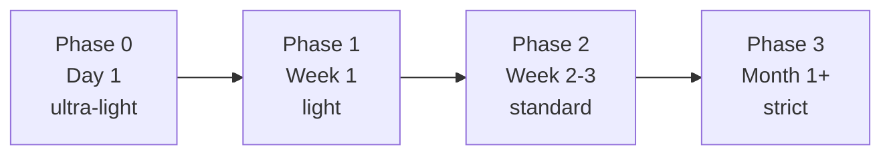

> 検証バージョン: **PlanGate v8.10.0**（2026-05）。最新は[公式リポジトリ](https://github.com/s977043/PlanGate)を参照。

前章で「計画どおりに作られたことを証明する（Verify）」ところまで来ました。最終章は、これを**個人の習慣からチームの仕組みへ広げ、計画の精度を継続的に上げていく**段階です。

PlanGate は最初から全機能を使う必要はありません。むしろ**いきなり全部を strict で強制すると、誤検知と摩擦でチームに嫌われ、即アンインストールされます**。鍵は「警告から始めて、習熟に応じて強制力を上げる」段階導入です。

## 段階導入 — Phase 0 から Phase 3 へ

PlanGate は導入を 4 つのフェーズに分けています。



| フェーズ | いつ | モード | ゲート | 主目的 |
|----------|------|--------|--------|--------|
| **Phase 0** | Day 1 | ultra-light | なし | まず体験する |
| **Phase 1** | Week 1 | light | C-1 簡易 | 計画を書く |
| **Phase 2** | Week 2-3 | standard | C-1 + C-3 | ゲートで止める |
| **Phase 3** | Month 1+ | standard + strict | C-1〜C-4 + V-3 | フル運用 |

Hook も同じく段階的に配線します。**Phase 1 では EH-1 を warning だけ**、Phase 2 で EH-2 / EH-3 を追加、Phase 3 で EH-1〜EH-7 を **strict（block）** へ ―― と、強制力をチームの慣れに比例させます。第 4 章で見た「default → strict」の段階は、この導入計画の一部です。

最初の 1 週間は「警告が出るだけで止まらない」状態で運用し、どこで何が引っかかるかをチームで観察する。これが定着の最大のコツです。止める前に、まず見えるようにする。

## Mode と Phase を混同しない

ここで多くの人がつまずくので、明確にしておきます。

- **Phase はチーム全体の導入段階** — どの Hook を配線し、どこまで strict 化したか
- **Mode は個々のタスクの厳格さ** — ultra-light / light / standard / high-risk / critical

両者は独立した軸です。たとえば **Phase 2 のチームでも、破壊的変更を含む 1 タスクは Mode=critical** で慎重に進められます。Phase が進むほど、各 Mode に応じた制約が「警告」から「ブロック」へ強化される、という関係です。

「チームはまだ Phase 1 だから全部ゆるくていい」ではなく、「チームは Phase 1 だが、このタスクは high-risk だから個別に厳しくする」と判断できる。この二軸が、画一的なルールでなく**リスクに比例した運用**を可能にします。

## 計測で改善する — Keep Rate と Metrics

段階導入で「広げた」あとは、「効いているか」をデータで見ます。PlanGate は `bin/plangate metrics` でワークフローのイベントを append-only の NDJSON に蓄積します。

```bash
# TASK からイベントを収集
bin/plangate metrics <TASK> --collect

# TASK 単位のサマリ
bin/plangate metrics <TASK> --report

# 全 TASK 横断で集計
bin/plangate metrics <TASK> --report --aggregate

# Keep Rate は独立コマンド（advisory）
bin/plangate keep-rate <TASK>
```

`--report` の出力は、たとえばこのような形です（何を見ればよいかのイメージ）。

```text
# Metrics summary: TASK-XXXX
- events: 9
- events by type:
    - c3_decided: 1
    - exec_started: 1
    - hook_violation: 2
    - v1_completed: 1
    - ...
- modes: {'standard': 1}

## Hook violations
- total: 2
- by hook_id:
    - EH-2: 1
    - EH-6: 1
- by result:
    - block: 2

## Gate decisions
- C-3: {'APPROVED': 1, 'CONDITIONAL': 0, 'REJECTED': 0}
- V-1: {'PASS': 1, 'FAIL': 0, 'WARN': 0}
```

`by hook_id` を見れば「**どの Hook が何回止めたか**」（この例では EH-2＝承認なし実装、EH-6＝スコープ外編集が各 1 回）が分かり、`Gate decisions` で「C-3 / V-1 がどう推移したか」が追えます。見た目の可視化より、**後から比較できる構造化データ**として残すことを優先した設計です。

ここで主要指標になるのが **Keep Rate**（計画がどれだけ守られたか）です。これは `metrics` とは別の独立コマンド `bin/plangate keep-rate` で算出します。計画と実装の乖離、Hook が何回止めたか、C-3 / C-4 の判断がどう推移したか ―― こうした数字を retrospective や週次レビューに乗せることで、「**計画の精度が上がっているか**」を勘でなくデータで確認できます。

> Keep Rate は advisory（参考指標）であり、合否を機械的に決めるものではありません。「先週より計画の逸脱が減ったか」を会話の起点にするための数字です。

### Keep Rate の読み方

数字は、単体の値より**推移と内訳**を見ます。

- **Keep Rate が低い（計画からの逸脱が多い）** → 計画の粒度が粗すぎる可能性。「Files に書いていない場所をよく触る」なら、計画段階のスコープ宣言が甘い。第 3 章の Plan の精度に投資が必要、というサインです。
- **Keep Rate は高いが手戻りも多い** → 計画は守れているが、計画そのものが間違っている（garbage-in）。Plan を守る Exec は効いているが、Plan の中身＝要件理解を見直すべき、と読めます。
- **hook_violation が特定の EH に偏る** → たとえば EH-6（scope 外編集）ばかりなら、PBI の `forbidden_files` 設計を見直す。EH-2（承認なし実装）ばかりなら、C-3 承認の運用が形骸化している。

つまり Keep Rate は「良い/悪い」を判定する数字ではなく、**どこに改善余地があるかを指す矢印**です。retrospective では「数字が動いた理由」を会話し、次スプリントの 1 つの実験につなげます。

計測の効用は、本書の主張への裏付けにあります。「計画の精度が成否を決める」を標語で終わらせず、**Keep Rate の改善と手戻りの減少が連動するか**を、自チームのデータで検証できる。因果を断定するのではなく、相関を観測して仮説を確かめる ―― これが Scale フェーズの到達点です。

## 導入でよくある失敗パターン

段階導入を謳っても、現場では次のつまずきが起きます。先回りしておきます。

- **いきなり Phase 3（strict 全部）から入る** — 誤検知の嵐でチームが疲弊し、1 週間で `PLANGATE_BYPASS_HOOK=1` が常設される。形だけ導入して実質オフ、という最悪の状態。必ず warning から始めること。
- **Phase だけ進めて Mode を考えない** — チーム全体を standard にしたのに、全タスクを一律 standard で回し、軽い変更にも重い計画を要求してしまう。タスクのリスクに応じて Mode を下げる判断（第 3 章）が要る。
- **計測を「監視」と受け取られる** — Keep Rate を個人の評価に使うと、数字を作るための形式的な計画が増える。計測は**チームの仕組みを改善するため**であって個人を測るためではない、と最初に合意しておく。
- **導入を一人で抱える** — 1 人が PlanGate を入れても、レビューする側がゲートを理解していないと C-3/C-4 が機能しない。最低限、承認する人がゲートの意味を共有している必要があります。

これらはどれも「ツールの問題」ではなく「導入の進め方の問題」です。段階導入は機能ではなく**運用の規律**だと捉えると、つまずきを避けられます。

## プライバシー — 計測しても漏らさない

metrics のイベントログ（`events.ndjson`）には、保存可能なカテゴリと禁止カテゴリが線引きされています（`docs/ai/metrics-privacy.md`）。ファイルのフルパス・コード本文・API キーといった機微情報は**スキーマ上そもそも保存できない**設計で、`EH-8` が違反を検知します。「計測のためにうっかり秘密を記録する」事故を構造的に防いでいます。

## PlanGate なしでも使える原則

最後に、本書の主張は特定ツールに閉じないことを強調しておきます。本書が繰り返してきた原則 ―― **計画を実装前に確定し、受入基準を先に固定し、逸脱を機械で止め、承認境界を通して変更する** ―― は、自前の git hook や CI、あるいは他のワークフローにも移植できます。

- 「計画なしの実装を止める」→ pre-commit hook で plan ファイルの存在を必須化
- 「承認境界を通す」→ PR テンプレートに承認チェック欄、CODEOWNERS でレビュー必須化
- 「受入基準を先に固定」→ Issue テンプレートに受入基準欄を強制
- 「逸脱を計測」→ CI で変更行数・スコープ逸脱を記録

PlanGate はこの原則の「動く参照実装」です。ツールを採用するかに関わらず、「No approval, no code.」という考え方そのものが AI 開発の事故率を下げます。本書で得た型を、あなたのチームの仕組みに翻訳してください。

## まとめ

- 段階導入（Phase 0〜3）で、ゲートと強制力をチームの習熟に比例させる。いきなり strict にしない。
- Phase（チームの導入段階）と Mode（タスクの厳格さ）は独立した二軸。混同しない。
- Keep Rate / Metrics で「計画の精度が上がっているか」をデータで確認する。
- プライバシーはスキーマで構造的に守る（EH-8）。
- 原則はツール非依存。PlanGate は参照実装であり、自前の仕組みにも移植できる。

ここまでで、Plan → Exec → Verify → Scale の一本道を走り切りました。付録では、現場で必ず出会う「動かない／邪魔だ」の救済（付録A）と、PlanGate がこの設計に至るまでの変遷（付録B）を扱います。

> 🔗 段階導入の詳細は公式 [段階的導入ガイド](https://github.com/s977043/PlanGate/blob/main/docs/staged-adoption-guide.md)へ。役立ったら [GitHub で star](https://github.com/s977043/PlanGate) を。Issue / Discussion でのフィードバックも歓迎です。
