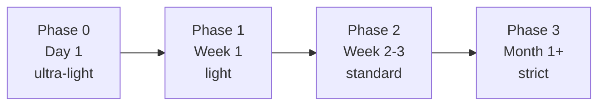

> 検証バージョン: **PlanGate v8.10.0**（2026-05）。

前章で「計画どおりに作られたことを証明する（Verify）」ところまで来ました。最終章は、これを**個人の習慣からチームの仕組みへ広げ、計画の精度を継続的に上げていく**段階です。

PlanGate は最初から全機能を使う必要はありません。むしろ**いきなり全部を strict で強制すると、誤検知と摩擦でチームに嫌われ、即アンインストールされます**。鍵は「警告から始めて、習熟に応じて強制力を上げる」段階導入です。

## 段階導入 — Phase 0 から Phase 3 へ

PlanGate は導入を 4 つのフェーズに分けています。



| フェーズ | いつ | モード | ゲート | 主目的 |
|----------|------|--------|--------|--------|
| **Phase 0** | Day 1 | ultra-light | なし | まず体験する |
| **Phase 1** | Week 1 | light | C-1 簡易 | 計画を書く |
| **Phase 2** | Week 2-3 | standard | C-1 + C-3 | ゲートで止める |
| **Phase 3** | Month 1+ | standard + strict | C-1〜C-4 + V-3 | フル運用 |

Hook も同じく段階的に配線します。**Phase 1 では EH-1 を warning だけ**、Phase 2 で EH-2 / EH-3 を追加、Phase 3 で EH-1〜EH-7 を **strict（block）** へ ―― と、強制力をチームの慣れに比例させます。第 4 章で見た「default → strict」の段階は、この導入計画の一部です。

最初の 1 週間は「警告が出るだけで止まらない」状態で運用し、どこで何が引っかかるかをチームで観察する。これが定着の最大のコツです。止める前に、まず見えるようにする。

## Mode と Phase を混同しない

ここで多くの人がつまずくので、明確にしておきます。

- **Phase はチーム全体の導入段階** — どの Hook を配線し、どこまで strict 化したか
- **Mode は個々のタスクの厳格さ** — ultra-light / light / standard / high-risk / critical

両者は独立した軸です。たとえば **Phase 2 のチームでも、破壊的変更を含む 1 タスクは Mode=critical** で慎重に進められます。Phase が進むほど、各 Mode に応じた制約が「警告」から「ブロック」へ強化される、という関係です。

「チームはまだ Phase 1 だから全部ゆるくていい」ではなく、「チームは Phase 1 だが、このタスクは high-risk だから個別に厳しくする」と判断できる。この二軸が、画一的なルールでなく**リスクに比例した運用**を可能にします。

## 計測で改善する — Keep Rate と Metrics

段階導入で「広げた」あとは、「効いているか」をデータで見ます。PlanGate は `bin/plangate metrics` でワークフローのイベントを append-only の NDJSON に蓄積します。

```bash
# TASK からイベントを収集
bin/plangate metrics <TASK> --collect

# TASK 単位のサマリ
bin/plangate metrics <TASK> --report

# 全 TASK 横断で集計
bin/plangate metrics --aggregate
```

ここで主要指標になるのが **Keep Rate**（計画がどれだけ守られたか）です。計画と実装の乖離、Hook が何回止めたか、C-3 / C-4 の判断がどう推移したか ―― こうした数字を retrospective や週次レビューに乗せることで、「**計画の精度が上がっているか**」を勘でなくデータで確認できます。

> Keep Rate は advisory（参考指標）であり、合否を機械的に決めるものではありません。「先週より計画の逸脱が減ったか」を会話の起点にするための数字です。

計測の効用は、本書の主張への裏付けにあります。「計画の精度が成否を決める」を標語で終わらせず、**Keep Rate が改善すれば手戻りが減る**という因果を、自チームのデータで検証できる。これが Scale フェーズの到達点です。

## プライバシー — 計測しても漏らさない

metrics のイベントログ（`events.ndjson`）には、保存可能なカテゴリと禁止カテゴリが線引きされています（`docs/ai/metrics-privacy.md`）。ファイルのフルパス・コード本文・API キーといった機微情報は**スキーマ上そもそも保存できない**設計で、`EH-8` が違反を検知します。「計測のためにうっかり秘密を記録する」事故を構造的に防いでいます。

## PlanGate なしでも使える原則

最後に、本書の主張は特定ツールに閉じないことを強調しておきます。本書が繰り返してきた原則 ―― **計画を実装前に確定し、受入基準を先に固定し、逸脱を機械で止め、承認境界を通して変更する** ―― は、自前の git hook や CI、あるいは他のワークフローにも移植できます。

- 「計画なしの実装を止める」→ pre-commit hook で plan ファイルの存在を必須化
- 「承認境界を通す」→ PR テンプレートに承認チェック欄、CODEOWNERS でレビュー必須化
- 「受入基準を先に固定」→ Issue テンプレートに受入基準欄を強制
- 「逸脱を計測」→ CI で変更行数・スコープ逸脱を記録

PlanGate はこの原則の「動く参照実装」です。ツールを採用するかに関わらず、「No approval, no code.」という考え方そのものが AI 開発の事故率を下げます。本書で得た型を、あなたのチームの仕組みに翻訳してください。

## まとめ

- 段階導入（Phase 0〜3）で、ゲートと強制力をチームの習熟に比例させる。いきなり strict にしない。
- Phase（チームの導入段階）と Mode（タスクの厳格さ）は独立した二軸。混同しない。
- Keep Rate / Metrics で「計画の精度が上がっているか」をデータで確認する。
- プライバシーはスキーマで構造的に守る（EH-8）。
- 原則はツール非依存。PlanGate は参照実装であり、自前の仕組みにも移植できる。

ここまでで、Plan → Exec → Verify → Scale の一本道を走り切りました。付録では、現場で必ず出会う「動かない／邪魔だ」の救済（付録A）と、PlanGate がこの設計に至るまでの変遷（付録B）を扱います。

> 🔗 段階導入の詳細は公式 [段階的導入ガイド](https://github.com/s977043/PlanGate/blob/main/docs/staged-adoption-guide.md)へ。役立ったら [GitHub で star](https://github.com/s977043/PlanGate) を。Issue / Discussion でのフィードバックも歓迎です。
