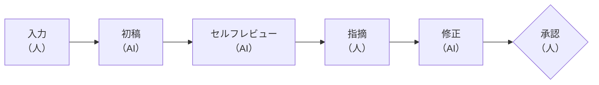

第 3 章から第 7 章で、計画に入れる要素を一つずつ見てきました。本章では、それらを 1 つの計画にまとめて読み、レビューしてみます。

題材は、これまでにも使ってきた PlanGate の公開サンプル、ユーザー登録 API を追加するタスクです（[examples/sample-task](https://github.com/s977043/PlanGate/tree/main/examples/sample-task)）。入力、計画、作業分解、テストケース、AI 自身によるセルフレビューの結果がそろっています。

:::message
このサンプルは、PlanGate の計画テンプレートが今の形になる前に作られたものです。本章の指摘と修正は、今のテンプレートの観点で読んだ筆者の作例で、サンプルに記録されている実際のやり取りではありません。
:::

## 流れ: 入力 → 初稿 → 指摘 → 修正 → 承認



high-risk 以上では、承認の前に別の AI のレビューが入ります。

## 1. 入力

入力の中身は第 3 章で見たとおりです。受入基準は 7 件（第 7 章の対応表）、やらないことにはテーブルのマイグレーションが入っています。不明点は「既存の認証ミドルウェアが、登録のリクエストを横取りしないか」です。

## 2. 初稿

この入力から AI が作った計画の主な中身は次のとおりです（原文は英語。筆者による要約）。

- **目標**: 登録エンドポイントを実装し、受入基準 7 件をすべて満たす
- **制約・やらないこと**: OAuth、メール確認、パスワードリセットは範囲外。レート制限はインフラの関心事なので扱わない。テーブルのマイグレーションは不要。**既存の認証ミドルウェアは変更しない**
- **進め方**: 入力チェック → 登録処理 → エンドポイント → アプリへの組み込み → テスト、の順に作る。ハッシュ化は必ず非同期で書き、平文のまま保存する事故を防ぐ
- **作業の分解**: 5 ステップ（第 4 章）。最初のステップは「既存の認証ミドルウェアと users テーブルの構造を確認する」
- **変更するファイル**: 新規 5 件、既存の変更 1 件（アプリ本体にルーターを組み込む）
- **リスクと対策**: `await` の書き忘れ、重複登録の競合（DB の UNIQUE 制約を最終的な守りにする）、ミドルウェアの横取り（最初のステップで確認する）
- **不明点**: 「最初のステップでの確認後、残る不明点はない」
- **Mode**: standard（新機能、リスク中と判定）

計画と同時に、作業の分解（5 つのステップを 15 のタスクに分けたものと、人が行う 2 つの承認）と、テストケース一覧（13 件）も作られています。

## 3. AI のセルフレビュー

人が読む前に、AI 自身が計画を点検します。サンプルには、その結果が残っています（収録されているのは点検項目の一部です）。

- すべての受入基準が作業のどこかに対応しているか → 対応している
- 不明点に、解消する手段がついているか → ミドルウェアの確認が最初のステップに入っている
- やらないことが明記されているか → 明記されている
- すべての受入基準にテストケースがあるか → ある
- テストケースの期待値が具体的か → 値のレベルで書かれている

結果はすべて合格でした。受入基準・作業・テストケースの対応がとれていることは、ここで機械的に確かめられます。

## 4. 人の指摘

セルフレビューが合格でも、人が読むと気になる点は残ります。セルフレビューが確かめるのは主に「欄が埋まっていて、互いに対応しているか」です。「書かれている前提は正しいか」「想定外のことが起きたらどうするか」は、読む人が考えます。

今のテンプレートの観点で読むと、たとえば次の 4 点を指摘できます。

**指摘 1: 不明点が、確かめる前に「なし」になっている**

不明点の欄は「最初のステップでの確認後、残る不明点はない」と書かれています。しかし計画を書いている時点では、最初のステップはまだ実行されていません。これは確かめた結果ではなく、確かめたらそうなるだろうという予想です（第 5 章）。

**指摘 2: ミドルウェアが横取りしていたら、どうするのかが書かれていない**

制約には「既存の認証ミドルウェアは変更しない」とあります。一方で、最初のステップでは「ミドルウェアが横取りしないか」を確認します。もし横取りしていたら、制約を守ったままでは登録できません。このとき AI がミドルウェアを直して進めてしまえば、制約を破ります。止まるのか、どう進めるのかが書かれていません（第 6 章）。

**指摘 3: 重複登録の防ぎ方を、ほかの案と比べていない**

重複登録は DB の UNIQUE 制約で防ぐ方針です。これ自体は妥当ですが、「登録前にアプリ側で同じメールアドレスを検索する」という案と比べた記録がありません。アプリ側の検索だけだと、同時に 2 件の登録が来たときにすり抜けます。比べて選んだ理由が残っていれば、後で誰かが「事前に検索すればよいのでは」と変更するのを防げます（第 4 章）。

**指摘 4: Mode を数え直すと high-risk 相当になる**

計画の Mode は standard ですが、第 4 章の数える目安では、変更ファイル 6 件（high-risk は 6〜15 件）と受入基準 7 件（同 6〜10 件）のどちらも high-risk の範囲に入ります。重い方を採るので、この計画は high-risk として扱います（第 4 章）。

## 5. 修正

指摘を受けて、AI が計画に次の欄を足します。以下は筆者が作った例で、実測結果の値は説明のためのものです。

```markdown
## 前提の実測

| 前提 | 確かめ方 | 実測結果 | 判定 |
|---|---|---|---|
| users.email に UNIQUE 制約がある | users テーブルのスキーマ定義を読む | email 列に UNIQUE 制約あり | 支持 |
| 認証ミドルウェアが POST /api/users を横取りしない | ミドルウェアの適用範囲の設定を読む | 適用はログイン後の API だけで、/api/users は対象外 | 支持 |

## 不明点

- なし（上の 2 件は承認の前に読んで確かめた）

## 止まる条件

- 計画を立て直す: users.email の UNIQUE 制約が効いていないと分かったら、重複登録の防ぎ方（設計案の比較）を決め直す
- 人の判断を待つ: 認証ミドルウェアが登録のリクエストを横取りすると分かったら（ミドルウェアは変更しない制約のため）。重複登録の防ぎ方を決め直すのにスキーマの変更が要るなら（やらないことに入っているため）

## Mode

- high-risk（standard から見直し）

## 設計案の比較（重複登録の防ぎ方）

| 案 | 複雑さ | 同時登録への強さ | 判定 |
|---|---|---|---|
| A: DB の UNIQUE 制約違反を捕まえて 409 を返す | 低 | 強い（DB が保証する） | 採用 |
| B: 登録前にアプリ側で同じメールアドレスを検索する | 低 | 弱い（検索と登録の間にすり抜ける） | 不採用 |
```

前提の 2 件は、作業の最初のステップに回さず、承認の前に確かめています。スキーマやミドルウェアの設定を読むのは実装ではないからです（第 5 章）。実測結果の欄が予想ではなく読んで確かめた事実で埋まったので、不明点の欄も「なし」と書けます。

変わったのは、主に「分からないこと」と「分からなかったときにどうするか」の書き方です。作業の中身はほとんど変わっていません。それでも、実装の途中で前提が崩れたときに AI がどう振る舞うかは、大きく変わります。

## 6. 承認

最後に、人が計画を承認します。PlanGate の承認には 3 つの結果があります。

| 結果 | 意味 | 次に進む先 |
|---|---|---|
| APPROVE（承認） | 計画に問題はない | 実装を始める |
| CONDITIONAL（条件付き承認） | 骨格は有効だが、直す点がある | 指摘を反映し、簡易なセルフレビューを通してから実装を始める |
| REJECT（差し戻し） | 根本的な問題がある | 計画を作り直す |

このサンプルの初稿は、目標、やらないこと、作業の順序、受入基準とテストケースの対応は筋が通っています。足りないのは前提と止まる条件の書き方で、計画の骨格ではないので、条件付き承認に当たります。ただし Mode を上げたので、別の AI のレビューを通してから人が承認します。

承認されるまで、実装には 1 行も進みません。承認されたあとで計画を書き換える必要が出たら、もう一度この承認を通します。

次章では、第 3 章から第 7 章で見た欄を 1 枚の骨組みにまとめ、自分の計画を書き始めます。
