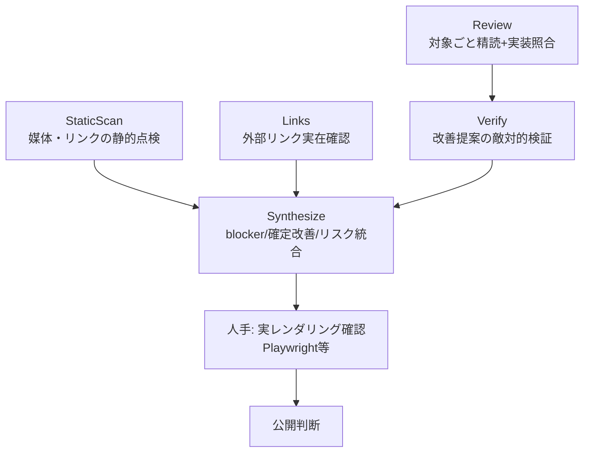

# ultracode 品質チェックのフロー

公開前の記事・Book に対する**網羅マルチエージェント品質チェック**の標準フロー。
単発レビューがすり抜ける実バグを掘り当てつつ、敵対的検証で「水増し改善」を却下することを狙う。

> 実体は再利用ワークフロー `.claude/workflows/ultracode-quality-check.js`。`Workflow({name:"ultracode-quality-check", args:{...}})` で呼ぶ。

## いつ使うか

- Zenn/Qiita 記事や Zenn Book を**公開する前の最終ゲート**
- 複数回のレビューで「もう収束した」と思った後の**ダメ押し**（収束の罠対策）
- 「誤りが信頼を壊す」成果物（技術書・サンプルコードを含む記事）に絞る（トークンコストがかかるため全件には使わない）

## フロー全体



| フェーズ | 何をするか | なぜ要るか |
|---------|-----------|-----------|
| **StaticScan** | 媒体固有の落とし穴を grep / Read で実ファイルから静的検出（SVG 画像参照・相対リンク・frontmatter。実際の行を引用）| **文章レビューでは出ない媒体仕様バグ**を先回り（後述の学び①）|
| **Review** | 対象ごとに並列精読。実装の正本（コード/スキーマ/docs）と照合 | 事実誤り・読者を誤らせる記述を捕捉 |
| **Links** | 外部リンクの実在/到達確認（**`args.links` を渡した時のみ実行**。未指定なら `brokenLinks` は常に 0）| リンク切れ防止 |
| **Verify** | 各改善提案を「本当に価値があるか／水増しか」と**敵対的に判定**（既定は却下）| 過剰研磨の抑制（学び③）|
| **Synthesize** | blocker / 確定改善 / リスクを構造化して返す | GO/NO-GO 判断材料 |
| **（人手）実レンダリング** | Playwright 等で**実際の表示**を確認（mermaid 描画・cover・画像）| エージェントは描画結果を見ない（学び①）|

## 使い方

```js
Workflow({ name: "ultracode-quality-check", args: {
  targets: ["books/plangate-guide/03_plan.md", "books/plangate-guide/04_exec.md"],
  implRepo: "/Users/user/Documents/GitHub/plangate",   // 事実照合の正本
  platform: "zenn-book",                                 // zenn | qiita | zenn-book
  links: ["https://github.com/s977043/PlanGate", ...],   // 任意
  claim: "計画(Plan)の精度が成否の大半を決める…",          // 任意の文脈
}})
```

返り値の `summary.goNoGo` と `staticBlockers` / `blockers` / `brokenLinks` / `confirmedImprovements` を見る。
`confirmedImprovements` だけを反映し、`rejectedImprovements` は**入れない**（水増し回避）。

> `links` を渡さない場合 Links フェーズはスキップされ、`brokenLinks` は検証されず 0 のまま返る。外部リンクの実在確認が必要なときは `args.links` に URL 配列を明示的に渡す。

## このフローが捕まえた実例（PlanGate Book）

5系統レビュー（セルフ＋マルチエージェント3視点＋Codex＋Gemini）が「収束」と判断した**後**に実行し、見逃しを掘り当てた:

- **承認記録 JSON のサンプルがスキーマ必須項目を欠く**（コピペで動かない）
- **自動承認機能の説明が前提条件を落とし、本の核と矛盾**
- 一方で「巻頭に版差注記」「付録に図」などの提案は**敵対的検証で却下**（水増し）

## 学び（このフローの設計根拠）

### ① 媒体での実表示は、文章レビューでは絶対に出ない
Book の図を SVG で用意していたが、**Zenn は markdown 画像の SVG を表示しない**。これは Playwright で実レンダリングして初めて発覚した。
→ 対策2段構え: **StaticScan で SVG 参照を静的検出**（先回り）＋ **公開前に実レンダリング確認を人手で必ず行う**（最終確認）。

### ② 事実照合の正本を与える
「実装の正本（コード/スキーマ/docs）」を `implRepo` で渡さないと、もっともらしいだけの指摘が混ざる。照合先があって初めて「スキーマ違反サンプル」のような実バグを掘り当てられる。

### ③ レビューは足し算でなく「足す/却下を分ける」
収束後のレビューは改善を出しすぎる。**敵対的検証（既定は却下）**で「本当に価値がある改善」だけを残す。`confirmedImprovements` のみ反映する運用を徹底する。

### ④ 「収束」を疑う最終パスの価値
複数レビューが「もう十分」と言っても、網羅的に並列で当てる最終パスは別の価値がある。ただし出た提案を全部入れると過剰研磨になるので ③ で選別する。

## 公開前チェックリスト（このフロー＋人手）

- [ ] `ultracode-quality-check` を実行し `staticBlockers` / `blockers` / `brokenLinks` が 0
- [ ] `confirmedImprovements` を反映（`rejectedImprovements` は入れない）
- [ ] **実レンダリング確認**（Playwright 等）: 図・cover・画像・コードブロックが実際に表示される
- [ ] `npm run check`（list:books / qiita-publish-hygiene 等）exit 0
- [ ] 公開は人間の最終判断（外向きアクション）。rate-limit / pacing を確認

## 限界

- トークンコストが大きい。全成果物に使わず、誤りが信頼を壊すものに絞る。
- エージェントは**描画結果を見ない**。実レンダリング確認は代替不可（人手 or Playwright）。
- 最終公開判断は人間が持つ。本フローは判断材料を増やす営み。
