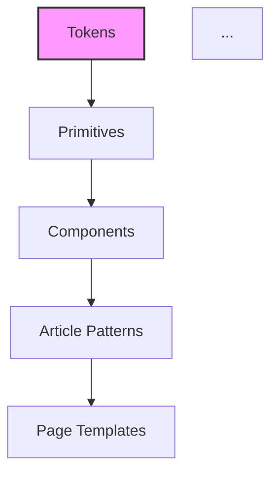

# articles/design-md-guide-and-adoption-log.mdの記事レビュー

## 🚩 レビュー方針
親ISSUE #11のレビュー観点（誤字脱字 / 用語誤用 / 文章わかりやすさ / 内容重複 / Web記事として読みやすい構成 / 技術記載の正確性 / 読者ニーズ充足 / SEO改善）に基づき、「DESIGN.md 導入ガイド: AI実装のための入口・契約・検証をどう整えるか」記事のレビューを実施しました。特にドキュメント運用を主題とする記事であるため、概念定義の一貫性、章構成の重複排除、および検証コマンド等の技術記載の具体性を重視して確認しています。

---

## チェック結果と観点

| 観点 | 担当者 | チェック項目 | 状況 |
| ---- | ------ | ------------ | ---- |
| **Webディレクター視点** | @claude | - 記事構成・読みやすさ<br>- 対象読者との整合性<br>- SEO最適化 | - [x] 済 |
| **Web編集者視点** | @claude | - 誤字脱字・表現統一<br>- 文章の明確性<br>- 重複表現の確認 | - [x] 済 |
| **Webエンジニア視点** | @claude | - `pnpm penpot:verify` などの記載の技術的妥当性<br>- 構成例（ディレクトリ図）の整合性<br>- 実装可能性 | - [x] 済 |

### 共通チェックリスト
- [x] 見出し階層が正しい（h2-h3の適切な使用）
- [x] 表に長文が入っていない
- [x] 画像パスが Zenn Preview で解決する（画像なし）
- [x] 公式リンクはクリック可能（Markdown link）
- [x] コードブロックの言語指定が適切
- [x] メッセージボックス（:::message）の適切な使用（未使用）

---

## 指摘コメント

### 該当箇所 1
L376-L385 （「最小導入の3ステップ」章）および L387-L402 （「まずはここから始める」章）

```md
## 最小導入の3ステップ

まずは、次の 3 ステップだけで十分です。

1. ルートに `DESIGN.md` を置き、参照順を書く
2. token の正本と component の対応ファイルを決める
3. AI とレビューが最初に見るファイルを固定する
```

```md
## まずはここから始める

最初から全部を揃える必要はありません。

まずは次の 4 つがあれば十分です。
```

### 問題点
「最小導入の3ステップ」と「まずはここから始める」が連続する章で、両方とも「まず最低限これだけ揃えればよい」という同一テーマを扱っており、内容が重複している。読者は「結局どれが最小構成なのか」を判断できず、記事末尾が冗長に感じる。

### 提案
どちらか一方の章に統合する。例えば「まずはここから始める」に寄せ、3ステップは「次のアクション」として埋め込む構成に変える。

```md
## まずはここから始める

最初から全部を揃える必要はありません。まずは次の 4 つで十分です。

- `DESIGN.md`（参照順と正本の所在を記載）
- color / typography / spacing の基礎ルール
- button / form / card の最小ルール
- AI やレビューが参照する順番

余力があれば、次の 3 つを順に追加します。

- コンポーネント対応表
- 外部 UI 語彙の正規化ルール
- 検証コマンド（例: `pnpm penpot:verify`）
```

---

### 該当箇所 2
L43, L173, L262-L266, L283, L314 （`pnpm penpot:verify` の記載）

```md
- `pnpm penpot:verify` を含む最小チェック手順
```

```md
このコマンドは少なくとも次の整合を検証します。

- token JSON と実装側のスタイル定義
- コンポーネント対応ファイルの token 参照
- 派生アセットの契約
```

### 問題点
記事全体で `pnpm penpot:verify` が検証の要として繰り返し参照されているが、このコマンドが何を実行するスクリプトなのか（package.json の定義、内部でどういうチェックを走らせているか）が具体的に示されていない。読者が別リポジトリで導入しようとした際に再現可能性がない。技術記事としての読者ニーズ（「どう実装するか」）を満たしきれていない。

### 提案
package.json のサンプル、または検証スクリプトの骨子を 1 箇所で提示し、他の箇所からは参照に留める。

```json
// package.json（抜粋）
{
  "scripts": {
    "penpot:verify": "node ./scripts/verify-design-tokens.mjs && node ./scripts/verify-component-mapping.mjs"
  }
}
```

```js
// scripts/verify-design-tokens.mjs（骨子）
import tokens from "../design/tokens.json" assert { type: "json" };
// 実装側のスタイル定義と突き合わせ、差分があれば exit 1
```

---

### 該当箇所 3
L60 （「AI 実装を前提にすると」の段落）

```md
特に AI 実装を前提にすると、「雰囲気としてこうしてほしい」では足りません。どのルールを優先し、どの語彙を内部名に変換し、どのファイルが一次情報かを明文化しておく必要があります。
```

および L11-L14 （TL;DR）

### 問題点
記事冒頭の TL;DR、「はじめに」、「DESIGN.md とは」、「なぜ DESIGN.md が必要なのか」の4つの章で、いずれも「正本・対応関係・検証を固定することが重要」というメッセージが繰り返し述べられている。導入部としてやや冗長で、読者が本題（導入手順）にたどり着くまでに時間がかかる。

### 提案
「はじめに」と「DESIGN.md とは」を統合し、「なぜ必要か」は箇条書きの問題リストに圧縮する。現状 L22-L45 を 2 段落程度に削るだけでも読みやすさが向上する。導入3章→2章に再編することで、目次の見通しも改善する。

---

### 該当箇所 4
L198-L203 （導入時系列の表）

```md
| 時期       | 変化                                                             | 意味                                                                     |
| ---------- | ---------------------------------------------------------------- | ------------------------------------------------------------------------ |
| v0.6.0     | Penpot 統合、デザイントークン CI、コンポーネントマッピングを強化 | デザインツールと実装の接続を作り始めた段階                               |
| v0.12.0    | 記事向けデザインシステムを拡張                                   | 汎用 UI だけでなく、記事体験に必要な部品を第一級市民として扱い始めた段階 |
| v0.17.0    | デザインシステム運用と AI デザイン指示テンプレートを全面更新     | AI に前提を渡す入口と運用導線を整えた段階                                |
| 2026-03-22 | `DESIGN.md` を入口として整備                                     | 「正本・対応関係・運用」の参照順を明確にした段階                         |
```

### 問題点
時期列の粒度が不揃い。3行目までは「バージョン番号 (v0.6.0 等)」で、最終行だけ「日付 (2026-03-22)」と表記が統一されていない。読者は「v0.17.0 は何年何月のリリースか」「`DESIGN.md` 整備は v 何か」という情報がなく、時系列として追えない。

### 提案
バージョン列と日付列を分けるか、「vX.Y.Z (YYYY-MM-DD)」形式で統一する。

```md
| 時期 (version / date)     | 変化                                                             | 意味                                       |
| ------------------------- | ---------------------------------------------------------------- | ------------------------------------------ |
| v0.6.0 (2025-XX-XX)       | Penpot 統合、デザイントークン CI、コンポーネントマッピングを強化 | デザインツールと実装の接続を作り始めた段階 |
| v0.12.0 (2025-XX-XX)      | 記事向けデザインシステムを拡張                                   | 記事体験の部品を第一級市民として扱う段階   |
| v0.17.0 (2025-XX-XX)      | デザインシステム運用と AI デザイン指示テンプレートを全面更新     | AI に前提を渡す入口と運用導線を整えた段階  |
| v0.18.x (2026-03-22)      | `DESIGN.md` を入口として整備                                     | 「正本・対応関係・運用」の参照順を明確化   |
```

---

### 該当箇所 5
L133-L143 （ディレクトリ構成図）

```text
/
├─ DESIGN.md
├─ design/
│  ├─ common.md
│  ├─ public.md
│  └─ admin.md
└─ apps/
   ├─ public-web/
   └─ admin-web/
```

### 問題点
「別リポジトリでこれから導入するなら」とある一方で、L147 では Growth Lab 自身が `public/admin` 分割ではなく `tokens -> primitives -> components -> article patterns -> page templates` の5層モデルを採用したと続く。読者は「結局この構成図はサンプルか推奨か」が混乱しやすい。また `design/common.md` `public.md` `admin.md` と TL;DR で推奨している「JSON を正本にする」方針が矛盾する（ここは Markdown 中心の構成例）。

### 提案
構成図の直後に「これは導入初期の最小サンプル。token の正本は JSON 化を推奨」と明示する。

```text
/
├─ DESIGN.md                 # 入口（参照順のみ）
├─ design/
│  ├─ tokens/                # token SSoT（JSON）
│  │  ├─ core.json
│  │  ├─ semantic.json
│  │  └─ component.json
│  ├─ common.md              # 共通ルールの説明
│  ├─ public.md              # 公開側の差分
│  └─ admin.md               # 管理画面側の差分
└─ apps/
   ├─ public-web/
   └─ admin-web/
```

---

### 該当箇所 6
L360-L362 （導入実績ログの表）

```md
| Repository | Scope                  | Stage   | Outcome                              | Notes                          |
| ---------- | ---------------------- | ------- | ------------------------------------ | ------------------------------ |
| growth-lab | public + design-system | adopted | 入口、SSoT、対応関係、検証導線を整備 | Penpot / React / AI 運用を接続 |
```

### 問題点
表のヘッダは英語 (Repository/Scope/Stage/Outcome/Notes) なのに、本文は日本語。さらに直後の L364-L374「追記テンプレート」は日本語項目（リポジトリ名/対象/導入時期…）で、二重にテンプレートが存在しフォーマットが一致しない。記事を見て追記しようとする読者が、どちらの形式を使うべきか判断しづらい。

### 提案
表の英語ヘッダを日本語に合わせるか、追記テンプレートの項目名を表ヘッダと一致させる。例えば表に合わせて統一するなら：

```md
### 追記テンプレート

- Repository:
- Scope:
- Stage: (considering / adopting / adopted)
- Outcome:
- Notes:
```

---

### 該当箇所 7
L149-L161 （Mermaid 図）

```md


### 問題点
Mermaid のノードラベルが英語 (`Tokens`, `Primitives` ほか) だが、直前の本文 L147 は日本語「`tokens -> primitives -> components -> article patterns -> page templates` の 5 層モデル」と記述。本文との表記揺れが起きている（小文字 / 大文字 / ハイフン区切り vs 英単語）。記事内の用語統一の観点で読みにくい。

### 提案
本文・図・後述引用で表記を統一する。例えば図側を本文に合わせる、または本文を図に合わせて固有名詞扱いする。

```md
Growth Lab は記事メディア中心のため `public/admin` 分割ではなく、**Tokens → Primitives → Components → Article Patterns → Page Templates** の 5 層モデルで整理しています。
```

---

### 該当箇所 8
L422-L442 （【追加】DESIGN.md 導入のFAQ）

### 問題点
追記日 (2026-04-05) 付きの FAQ 章が本文末尾に「【追加】」として挿入されているが、本文側にはすでに「うまくいかなかったこと」「運用ルール」「最小導入の3ステップ」「まずはここから始める」「まとめ」と、FAQ と内容が重複する章が複数ある（例: Q. 軽量に始めてよい？ vs 「最小導入の3ステップ」/「まずはここから始める」）。SEO/読了率の観点でも、同じトピックが複数箇所に散在するのは不利。

### 提案
FAQ を本文の適切な位置（例: 「まとめ」の直前）に統合し、既存章と重複する項目を削る。または FAQ を残すなら、本文側の重複章を「詳細は FAQ 参照」に置き換える。【追加】という編集記号は公開記事では外す（内部メモ的な印象を与えるため）。

```md
## よくある質問 (FAQ)

### Q. 導入はどのタイミングが最適？
A. 既存プロダクトでも「判断基準が曖昧」「AIや人のレビュー観点が揃わない」と感じた時点で導入効果があります。
...
```

---

## 総合評価

### 良い点
- **明確な主張**: 「DESIGN.md は入口であり辞書ではない」というメッセージが一貫している
- **実運用の記録**: Growth Lab のバージョン遷移と `pnpm penpot:verify` の導入経緯が具体的
- **3ペルソナへの配慮**: デザイナ / エンジニア / AI の3者の視点で役割を整理
- **追記可能なテンプレート**: 導入実績ログのテンプレートが用意されており、更新型記事として運用しやすい

### 改善点
- **重複章の整理**: 「最小導入の3ステップ」と「まずはここから始める」、本文と追記 FAQ の重複を解消
- **技術記載の具体性**: `pnpm penpot:verify` の中身を 1 箇所で提示し、再現可能性を高める
- **表記統一**: バージョン/日付の粒度、Mermaid 図と本文の英日表記、テンプレートの項目名
- **構成例の意図明示**: ディレクトリ構成図が「初期サンプル」か「推奨構成」かを読者に誤解させない

### 推奨アクション
1. **重複章のマージ**: 最小導入・FAQ・まずはここから、を 1 章 2 節に統合
2. **`pnpm penpot:verify` の内部開示**: package.json と検証スクリプトの骨子を提示
3. **バージョン列の統一**: 時系列表のフォーマット修正
4. **構成図の補足**: 「これは最小サンプル」である旨を明記
5. **編集記号の除去**: 【追加】等の内部向け記号を公開版から除去

### SEO観点での改善提案
- **タイトル最適化**: 「AI駆動開発」「デザインシステム」「2026年版」などの検索語を含めると流入増が見込める（例: 「DESIGN.md 導入ガイド：AI駆動デザインシステムの入口・契約・検証（2026年版）」）
- **メタディスクリプション / 冒頭要約**: TL;DR を短く絞り、冒頭 150 文字前後に検索キーワードを自然に含める
- **内部リンクの強化**: 「関連ページ」が Growth Lab 公式のみなので、Zenn 内の関連記事（AI駆動 TDD、PlanGate 等）へのリンクを追加
- **見出しへのキーワード反映**: 「DESIGN.md とは」「DESIGN.md には何を書くのか」はそのままで良いが、「公開側 / 管理画面側でどう分けるか」を「公開画面と管理画面で DESIGN.md をどう分けるか」に変えると検索意図との一致度が上がる

---

*レビュー実施者: @claude*  
*レビュー実施日: 2026-04-15*
