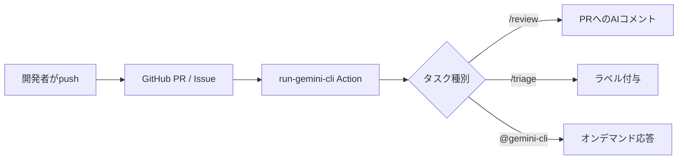

# articles/gemini-cli-github-actions-zenn-article.mdの記事レビュー

## 🚩 レビュー方針
親ISSUE #11のレビュー観点（誤字脱字 / 用語誤用 / 文章わかりやすさ / 内容重複 / Web記事として読みやすい構成 / 技術記載の正確性 / 読者ニーズ充足 / SEO改善）に基づき、「GitHubにAI開発チームメイトを迎えよう — Gemini CLIでレビュー時間を1/3に短縮する方法」記事のレビューを実施しました。Gemini CLI GitHub Actions の導入記事であるため、数値的主張の根拠、YAML 等の具体的な実装例の不足、失敗談セクションの再現性を中心に確認しています。

---

## チェック結果と観点

| 観点 | 担当者 | チェック項目 | 状況 |
| ---- | ------ | ------------ | ---- |
| **Webディレクター視点** | @claude | - 記事構成・読みやすさ<br>- 対象読者との整合性<br>- SEO最適化 | - [x] 済 |
| **Web編集者視点** | @claude | - 誤字脱字・表現統一<br>- 文章の明確性<br>- 重複表現の確認 | - [x] 済 |
| **Webエンジニア視点** | @claude | - run-gemini-cli Action の記載の正確性<br>- ワークフロー YAML の具体性<br>- 失敗談の再現可能性 | - [x] 済 |

### 共通チェックリスト
- [x] 見出し階層が正しい（h2-h3の適切な使用）
- [x] 表に長文が入っていない
- [x] 画像パスが Zenn Preview で解決する（画像はコメントアウト済み）
- [x] 公式リンクはクリック可能（Markdown link）
- [x] コードブロックの言語指定が適切
- [x] メッセージボックス（:::message）の適切な使用

---

## 指摘コメント

### 該当箇所 1
L9-L14 （タイトル / 冒頭の数値訴求）および L53 （使いどころ）

```md
> 1. **レビュー時間を最大67%削減**する“初期チェック”ワークフローの組み方
```

```md
コードを書く前にレビュー対応で1日が溶ける──その課題を**AI開発チームメイト**が解決します。
```

### 問題点
タイトル「レビュー時間を1/3に短縮」、冒頭「最大67%削減」という具体的数値が示されているが、本文内にこの数値の測定条件や根拠となるデータ（対象リポジトリ規模、PR 数、before/after の計測方法）が一切記載されていない。技術記事としては誇大訴求と誤解される恐れがある。また 1/3 と 67% は本来「1/3 に短縮 = 約67%削減」と整合するが、この整合の説明もない。

### 提案
根拠を本文内に節として追加するか、記述を体感ベースに緩める。

```md
> **注記**: 本記事の「67%削減」は筆者運用の n=XX PR における一次チェック往復回数の減少率です。プロジェクト規模により効果は異なります。
```

もしくは、

```md
> 1. レビューの**初期チェック往復を大幅に減らす**ワークフローの組み方
```

---

### 該当箇所 2
L79-L85 （最小3ワークフロー）

```md
## 最小3ワークフロー（最新版）

- **PR初期チェック** `/review`
- **Issueトリアージ** `/triage`
- **オンデマンド依頼** `@gemini-cli ...`

*(具体的 YAML はリポジトリに同梱)*
```

### 問題点
記事のメインコンテンツであるはずの「最小3ワークフロー」が項目の箇条書きのみで、実装例（YAML）が「リポジトリに同梱」として本文に載っていない。読者が記事を見ながら実装を進められず、技術記事としての読者ニーズを満たしていない。リンク先も示されていないため、リポジトリに辿り着く手段もない。

### 提案
最低限 `/review` の YAML サンプルと、参照すべきリポジトリへのリンクを本文に追加する。

````md
## 最小3ワークフロー（最新版）

### PR 初期チェック (`/review`)

```yaml
# .github/workflows/gemini-review.yml
name: Gemini PR Review
on:
  pull_request:
    types: [opened, synchronize]
  issue_comment:
    types: [created]

jobs:
  review:
    if: github.event_name == 'pull_request' || contains(github.event.comment.body, '/review')
    runs-on: ubuntu-latest
    steps:
      - uses: actions/checkout@v4
      - uses: google-github-actions/run-gemini-cli@v1
        with:
          gemini_api_key: ${{ secrets.GEMINI_API_KEY }}
          prompt_file: .gemini/review.md
```

詳細な YAML は [サンプルリポジトリ (URL)](https://github.com/xxx/yyy) を参照してください。
````

---

### 該当箇所 3
L63-L75 （失敗談: ラベル暴走事件）

```md
| Step | 対処内容 |
|---|---|
| 1 | 誤検知コメントを確認（`similarity < 0.5` 多発） |
| 2 | `GEMINI.md` に「言語が異なる場合は `needs-translation` のみ付与」と追記 |
| 3 | `/rollback-labels last 20` で直近 20 Issue のラベル一括削除 |
| 4 | `confidence_threshold` を 0.7 に引き上げ |
| 5 | 再テスト → 過剰付与ゼロを確認 |
```

### 問題点
`/rollback-labels last 20` や `confidence_threshold` といったコマンド・パラメータが、run-gemini-cli Action の標準機能であるかのように書かれているが、これらは公式 Action の標準コマンドとして提供されているものではない。読者が同じコマンドを叩いても再現できず、技術的正確性に疑問が残る。`similarity < 0.5` も前後文脈で何を指すか不明瞭。

### 提案
カスタム実装である旨を明示し、実装方法のヒントを追記する。

```md
| Step | 対処内容 |
|---|---|
| 1 | 誤検知コメントを確認（類似度スコア 0.5 未満が多発していた） |
| 2 | `GEMINI.md` に「言語が異なる場合は `needs-translation` のみ付与」と追記 |
| 3 | 自作スクリプト（gh CLI）で直近 20 Issue のラベルを一括削除 |
| 4 | ワークフローの入力変数 `confidence_threshold` を 0.7 に引き上げ |
| 5 | 再テスト → 過剰付与ゼロを確認 |

> 注: `/rollback-labels` や `confidence_threshold` は run-gemini-cli 標準機能ではなく、筆者が `GEMINI.md` + `gh` CLI で実装したカスタムコマンドです。
```

---

### 該当箇所 4
L33-L48 （AIコメントのサンプル）

```md
> ```
> ❌  N+1 クエリの可能性を検出:
>     Order.find({ include: 'items' })
>     ↳ 改善案: `Order.preload('items')`
```

### 問題点
サンプルに示された `Order.find({ include: 'items' })` → `Order.preload('items')` という改善案は、ActiveRecord (Rails) の記法と Mongoose/Sequelize 系の混在になっており、どの ORM を想定しているか不明。Rails の ActiveRecord に `find({ include: ... })` という書き方は存在せず、通常 `Order.includes(:items)` または `Order.preload(:items)` を使う。読者が真に受けると誤った改善提案を学んでしまう。

### 提案
ActiveRecord に揃える、または JS 系 ORM に揃える。ActiveRecord に揃える例：

```md
> ❌  N+1 クエリの可能性を検出:
>     Order.all.each { |o| o.items }
>     ↳ 改善案: `Order.preload(:items)` または `Order.includes(:items)`
```

もしくは、特定 ORM に依存しない表現に変える。

```md
> ❌  N+1 クエリの可能性を検出:
>     注文を1件ずつ取得したあと、各注文の items を個別にロードしています
>     ↳ 改善案: 事前にプリロード（ORM のイーガーロード API を使用）
```

---

### 該当箇所 5
L51-L59 （使いどころ 7領域）

```md
1. **PRの初期チェック** – スタイル／アンチパターンを自動指摘
2. **Issue駆動開発の加速** – 再現手順整形・重複検知・受け入れ基準草案
3. **テスト & 品質保証** – ユニット/E2Eテスト生成・レグレッション抽出
...
7. **設計ブレインストーミング & 計画** – 代替アーキ案・粗見積もり・週次レポート
```

### 問題点
この章と、直後の「最小3ワークフロー」(L79-L85) および「運用Tips」(L102-L107) と、情報の粒度と重複が大きい。例えば「1. PRの初期チェック」「/review」「`/review /explain /write tests` で使い分け」が3箇所で言及されている。記事後半になるほど同じ話題を異なる切り口で繰り返す構成になっており、読者の理解が深まらない。

### 提案
「使いどころ」→「具体ワークフロー」→「運用Tips」の階層構造を明確化する。例えば、7領域のリストから `/review` `/triage` `@gemini-cli` を各領域にマッピングする表にすれば、以降の章とつながる。

```md
| 領域 | コマンド | 主な成果物 |
| --- | --- | --- |
| PR 初期チェック | `/review` | PR 上のレビューコメント |
| Issue 駆動開発 | `/triage` | ラベル・要約コメント |
| テスト生成 | `@gemini-cli write tests` | テストコード差分 |
| ドキュメント | `@gemini-cli explain` | README/Docs 更新 |
...
```

---

### 該当箇所 6
L91-L98 （`GEMINI.md` サンプル）

```md
# プロジェクト前提（AI開発チームメイト向け）
- ランタイム: Node.js 20 / Next.js
- コーディング: TypeScript、public関数はJSDoc必須
- 依存追加は原則PRで合意
- PR粒度: 1PR=1目的、diff 300行目安
- テスト: Unit中心、E2EはPlaywrightで主要シナリオのみ
```

### 問題点
`GEMINI.md` のサンプルがプロジェクトの「前提」のみで、L89 見出し「AI開発チームメイトの教科書」と L105 「誤指摘は GEMINI.md に NG例 として即追記」で示されている運用 (NG例やコマンド定義) が含まれていない。前述の失敗談で「GEMINI.md に追記して抑制」とあるが、そのサンプルが記事内に存在しないため、読者は具体的な書き方を学べない。

### 提案
`GEMINI.md` のサンプルに、レビュー観点と NG 例、コマンド出力の定義を含める。

```md
# プロジェクト前提（AI開発チームメイト向け）
- ランタイム: Node.js 20 / Next.js
- コーディング: TypeScript、public関数はJSDoc必須
- 依存追加は原則PRで合意
- PR粒度: 1PR=1目的、diff 300行目安
- テスト: Unit中心、E2EはPlaywrightで主要シナリオのみ

# レビュー観点 (優先順)
1. セキュリティ（SQLインジェクション/XSS/機密情報）
2. N+1 クエリ等のパフォーマンス
3. TypeScript 型安全性
4. テスト不足

# NG例（過去の誤指摘）
- 英語 Issue に日本語ラベルを付与しない（代わりに `needs-translation`）
- `any` 型の警告はルール上許容している場合がある（tsconfig 参照）
```

---

### 該当箇所 7
L119-L129 （自社メディア / 関連記事）

### 問題点
「自社メディア」と「関連記事」の両方が `:::message` ブロックで連続して配置されているため、記事の「まとめ」(L111-L115) の後に宣伝ブロックが 2 つ続く構成になっている。読者にとっての離脱ポイントが増える構成であり、SEO 観点でもページ最下部のリンク過多は評価を下げる要因になる。

### 提案
「関連記事」を「まとめ」の前に配置し、「自社メディア」を最下部に回す。また、`:::message` ではなく通常のリストにして視覚的ノイズを減らす選択肢もある。

```md
## 関連記事

本記事と合わせて読むと理解が深まります。

- [仕様を揃えて止めない：マルチエージェント開発の3原則...](https://zenn.dev/minewo/articles/sdd-tdd-nonblocking-agent)
- [アジャイルでAI駆動開発をどう回すか: PlanGate...](https://zenn.dev/minewo/articles/plangate-ai-coding-workflow)
- [Next.js App Router時代のAI-driven TDD...](https://zenn.dev/minewo/articles/ai-driven-tdd-nextjs)

## まとめ

...

## 自社メディア

- [Growth Lab](https://the3396.com/) - AIエージェント開発、SEO最適化、仕様駆動開発の検証ログ
```

---

### 該当箇所 8
L18-L28 （Mermaid 図）

```mermaid
graph LR;
    dev["Dev pushes branch"] --> pr["GitHub PR / Issue"];
    pr --> act["run-gemini-cli Action"];
    act --> task{Task type?};
    task -->|"/review"| review["AI comment (PR)"];
    task -->|"/triage"| label["Label added"];
    task -->|@gemini-cli| ondemand["On-demand reply"];
```

### 問題点
Mermaid 内のラベルが英語なのに対し、本文や図のポイント解説は日本語で統一されていない。さらに `dev` ノードは「Dev pushes branch」（動詞開始）、他ノードは名詞句と、ラベルの文法が不統一。Zenn 読者のメインは日本語話者と想定されるため、図の可読性が落ちている。

### 提案
ラベルを日本語、または名詞句に揃える。



---

## 総合評価

### 良い点
- **訴求ポイントが明確**: 冒頭で「得られるもの」を3つ提示し、読者メリットが伝わりやすい
- **失敗談セクション**: 成功事例だけでなくラベル暴走事件のリカバリを載せており、現場感がある
- **7領域のハイライト**: Gemini CLI の利用範囲を網羅的に提示
- **Mermaid 図**: ワークフロー全体像が一枚絵で把握できる

### 改善点
- **数値訴求の根拠不足**: 「レビュー時間1/3」「67%削減」の出典・測定条件が未記載
- **YAML 実装例の欠落**: 「リポジトリに同梱」のみで本文内に具体例がない
- **カスタムコマンドと標準機能の混在**: `/rollback-labels` `confidence_threshold` が公式機能かのように見える
- **コードサンプルの妥当性**: N+1 改善例の ORM 記法が不整合
- **重複章の整理**: 「使いどころ」「最小3ワークフロー」「運用Tips」で類似情報が分散

### 推奨アクション
1. **数値の根拠追記**: 計測方法・サンプルサイズを明記、または控えめな表現に変更
2. **YAML サンプル追加**: 最低限 `/review` の完全な `.github/workflows/*.yml` を掲載
3. **カスタム機能の注記**: `/rollback-labels` 等は自作である旨を明示
4. **ORM コード例の修正**: 言語/フレームワークを特定するか、抽象化する
5. **章構成の統合**: 「使いどころ」をマッピング表に変換し、以降の章と接続

### SEO観点での改善提案
- **タイトル最適化**: 現状「レビュー時間を1/3に短縮」は魅力的だが、根拠が未記載のため信頼性を損なう。「Gemini CLI GitHub Actions 入門：PRレビューをAIに任せる最小3ワークフロー」のように具体的な対象が分かる表現が望ましい
- **メタディスクリプション**: 冒頭の Blockquote を記事の要約として整えると、検索結果プレビューで訴求できる
- **キーワード整合**: 本文中に「Gemini CLI」「GitHub Actions」「run-gemini-cli」が散在しているため、h2 見出しに「Gemini CLI GitHub Actions」という一次検索語を入れる
- **内部リンク**: 関連記事3本が末尾にまとまっているが、本文中「詳しくは○○の記事参照」の形で本文内リンクも追加すると回遊率が上がる

---

*レビュー実施者: @claude*  
*レビュー実施日: 2026-04-15*
