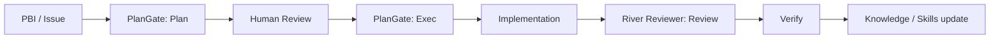
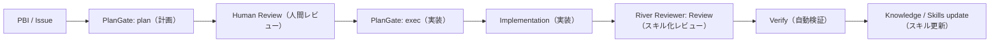

# articles/ai-dev-guardrail-plangate-river-reviewer.mdの記事レビュー

## 🚩 レビュー方針

親 Issue #11 のレビュー観点（誤字脱字／用語誤用／文章わかりやすさ／内容重複／Web 記事として読みやすい構成／技術記載の正確性／読者ニーズ充足／SEO 改善）、および Zenn 読みやすさ観点 8 項目に基づき、本記事を再レビューしました。前回レビュー（2026-04-19）指摘のうち、英語ラベル副題（指摘3）、`plan`/`exec` フェーズ説明（指摘10）、Agent Skills の本文中リンク（指摘3）、River Reviewer Docs の URL 統一（指摘4）、関連記事ブロックへの補足文（指摘9）は既に本文に反映済みであることを確認しています。本再レビューでは、(1) 公開済み同著者記事（`plangate-ai-coding-workflow` / `zenn-river-reviewer-architecture`）との住み分け、(2) コア主張の反復密度、(3) TL;DR 表の粒度整合、(4) 「自社メディアでの位置づけ」節の宣伝色、(5) 読者体験として本記事単独で完結しているか、を重視して確認しました。

---

## チェック結果と観点

| 観点 | 担当者 | チェック項目 | 状況 |
| ---- | ------ | ------------ | ---- |
| **Webディレクター視点** | @claude | - 記事構成・読みやすさ<br>- 対象読者との整合性<br>- SEO 最適化（同著者記事との差別化） | - [x] 済 |
| **Web編集者視点** | @claude | - 誤字脱字・表現統一<br>- 文章の明確性<br>- 重複表現の確認 | - [x] 済 |
| **Webエンジニア視点** | @claude | - 技術的記述の正確性<br>- mermaid 図の整合性<br>- 外部リンク・リポジトリの妥当性 | - [x] 済 |

### 共通チェックリスト
- [x] 見出し階層が正しい（h2-h3 の使い分けは適切）
- [x] 表に長文が入っていない（TL;DR 表は簡潔）
- [x] 画像パスが Zenn Preview で解決する（画像なし）
- [x] 公式リンクはクリック可能（Markdown link 形式）
- [x] コードブロックの言語指定が適切（mermaid のみ、コード例少なめ）
- [x] メッセージボックス（:::message）の適切な使用（冒頭 2 連、関連記事 1 つ）

### Zenn 読みやすさチェック（構成・圧縮）
- [x] 冒頭で記事の価値を先出ししている（L13-19 の `:::message`「この記事で得られること」）
- [x] 詳細群の前に全体像（TL;DR 表）を提示している（L37-43）
- [ ] 派生論点（Meta 的な話）が本筋の後ろに配置されている → **「自社メディアでの位置づけ」がまとめ直前に挿入され宣伝色（指摘3）**
- [x] コマンド/コード断片が本文を埋めず、narrative が優先されている（概念記事として成立）
- [x] 英語ラベルに日本語副題が添えられている（前回指摘 3 反映済：`Plan（計画）/ Validate（ゲート承認）/ Verify（自動検証）`、`Agent Skills（レビュー観点を再利用可能な単位に切り出したもの）`）
- [ ] 各セクションの要点が 1 行で先出しされている → **「実務で効く使い分け」節（L146）は導入が薄く、3 ステップの狙いが先出しされていない（指摘6）**
- [x] まとめ前に記事の主張を再掲している（L226-230）
- [x] 硬い漢字タイトルを柔らかい表現に言い換えている（「実装前の安全装置」「レビュー知識の再現装置」など narrative 調）

---

## 指摘コメント

### 該当箇所 1
L17, L48, L140, L203-L204 （「実装前と実装後でガードを分ける」主張の 4 回反復）

```markdown
（L17）
- 実装前と実装後でガードを分ける考え方

（L48）
- **実装前** と **実装後** のガードを分けると、AI の自由度と安全性を両立しやすい

（L140）
つまり、**実装の前後でガードを分ける**わけです。

（L203-204）
- PlanGate は「進む前」に止める
- River Reviewer は「進んだ後」に整える
```

### 問題点
記事のコア主張である「実装前と実装後でガードを分ける」が、「この記事で得られること」 → TL;DR → 「2つをつなぐと何が起きるか」 → 「どちらを先に入れるべきか」の 4 箇所でほぼ同じ言い回しで繰り返されている。特に L140 は直前の箇条書き（L137-138「PlanGate は『着手前』の制御 / River Reviewer は『変更後』の評価」）と同じ意味であり、1 つの段落内で同じ主張を 2 回書いている状態になっている。概念記事として主張を強調する意図は理解できるが、Zenn 読者の多くは情報密度を重視するため、4 回反復は冗長と映りやすい。

### 提案
L140 の「つまり、**実装の前後でガードを分ける**わけです。」を削除し、直前の箇条書きから L142 に直接つなげる。反復を 4 回 → 3 回（冒頭要約／TL;DR 末尾／結論の再提示）に絞る。

```markdown
（L135-142 修正案: L140 削除）
この流れの良さは、AI の役割が曖昧にならないことです。

- PlanGate は「着手前」の制御
- River Reviewer は「変更後」の評価

これにより、AI に任せる範囲が広がっても、レビュー品質と意思決定の履歴が残ります。
```

**優先度: Medium**

---

### 該当箇所 2
L55-L89（PlanGate 節）と L93-L115（River Reviewer 節）の個別紹介に割いた文量

```markdown
（L55-L89 PlanGate 解説 = 約 35 行）
## PlanGate は「実装前の安全装置」
...
### PlanGate が向いている場面
- スプリント単位で PBI を回している
- AI に実装を任せたいが、暴走が怖い
- TDD を先に置きたい
- 仕様の抜け漏れを人間が確認したい
PlanGate は、AI 駆動開発の「着手条件」を明確にします。
だから、**スピードを落とす仕組みではなく、手戻りを減らす仕組み**として見るのが正確です。

（L93-L115 River Reviewer 解説 = 約 23 行）
## River Reviewer は「レビュー知識の再現装置」
...
### River Reviewer の中心思想
- 暗黙知をスキルとして外出しする
- リスクに応じて自由度を設計する
- `Plan（計画）/ Validate（ゲート承認）/ Verify（自動検証）` でレビュー運用を分ける
- 人間の承認点を残したまま、AI の再現性を上げる
```

### 問題点
本記事の独自価値は「2 つをつなぐ」「2 層ガード」の視点にあるはずだが、記事全 248 行のうち個別紹介（L55-L115 = 約 60 行）が約 1/4 を占めている。`plan`/`exec` の詳細リンク（L70）と Agent Skills の詳細リンク（L95）は既に本文中に挿入済みで導線は整備されたが、それでも個別紹介の文量そのものが「2 層ガード」視点のパート（L119-144 = 約 25 行）より多い。結果として、読者が「2 つをつなぐ」視点に到達するまでに同著者記事の要約を 60 行読むことになる。

### 提案
個別紹介 2 節を次のように圧縮し、「2 つをつなぐと何が起きるか」以降の独自パートに文量をシフトする。

- PlanGate 節: `### PlanGate が向いている場面`（L81-87）の箇条書きを削除し、「スプリントで PBI を回す現場や、TDD を先に置きたい場面に馴染みやすい」の 1 文に縮約（別記事で詳述されているため）。
- River Reviewer 節: `### River Reviewer の中心思想`（L108-114）の箇条書きのうち、「暗黙知をスキルとして外出しする」「人間の承認点を残したまま、AI の再現性を上げる」は既に L97-106 の本文で触れているため、箇条書き全体を削除または 2 項目に圧縮。

圧縮で生まれた行数は、「2 つをつなぐと何が起きるか」節（L119-142）に、具体例（PlanGate 通過後の計画が River Reviewer のレビュー観点に流れる具体的な動線など）を追加する形で使うと、本記事独自の価値が際立つ。

**優先度: High**

---

### 該当箇所 3
L210-L220 （「自社メディアでの位置づけ」節の配置と内容）

```markdown
## 自社メディアでの位置づけ

Growth Lab では、AI エージェント開発、記事制作フロー、SEO 運用を、検証ログと公開ドキュメントとして整理しています。

この記事の位置づけとしては、

- **PlanGate** = AI 駆動開発の入り口を整える
- **River Reviewer** = AI 駆動開発のレビュー品質を整える
- **Growth Lab** = その運用知見を公開し続けるハブ

という関係です。
```

### 問題点
「自社メディアでの位置づけ」という節名と内容が、技術記事本編の流れに対して宣伝色が強く浮いている。Zenn 読みやすさ観点 3「派生論点が本筋の後ろに配置されているか」の違反で、読者の 8 割が求めている「PlanGate と River Reviewer の使い分け」という本筋の直後・まとめの直前に挟まっているため、締めの勢いを削いでいる。また、箇条書き 3 項目のうち `Growth Lab = その運用知見を公開し続けるハブ` は本記事の技術解説としては情報が浅く、すでに冒頭 `:::message`（L10）で Growth Lab への言及は済んでいるため実質的な重複でもある。

### 提案
(A) この節を削除し、参考リンク節（L235-240）に Growth Lab リンクをそのまま残す（既存で L237 にあるため実質重複解消）。
(B) どうしても残したいなら、節名を「この記事の位置づけ」に変更し、「Growth Lab の告知」ではなく「2 記事との住み分け」を示す位置取りマップに差し替える。関連記事ブロック（L244-248）と統合しても良い。

```markdown
（B案: 位置取りマップに差し替え）
## この記事の位置づけ

同テーマの既存記事との住み分けは次の通りです。

- 本記事 = 2 層ガードとしての **関係整理**
- [PlanGate 記事](https://zenn.dev/minewo/articles/plangate-ai-coding-workflow) = 実装前ゲートの **テンプレート詳細**
- [River Reviewer 記事](https://zenn.dev/minewo/articles/zenn-river-reviewer-architecture) = レビュー側の **アーキテクチャ詳細**

本記事だけで概観を掴み、深掘りは各記事へ遷移してください。
```

**優先度: Medium**

---

### 該当箇所 4
L37-L43 （TL;DR 表の「強み」欄の情報粒度）

```markdown
| 役割 | PlanGate | River Reviewer |
| --- | --- | --- |
| 主な対象 | 実装前 | 実装後 |
| 目的 | 計画が通るまでコードを書かせない | 暗黙知のあるレビューを再現可能にする |
| 主な成果物 | 計画書 / ToDo / テストケース / 自己レビュー | Agent Skills（レビュー知識のスキル化）ベースのレビュー / Verify（検証コマンド実行） |
| 強み | ゲート設計 | 再現性と学習可能性 |
```

### 問題点
前回指摘 7 を受けて「主な成果物」行は粒度が揃ったが、「強み」行は左右の情報量と抽象度が依然不揃い。PlanGate 側が「ゲート設計」（4 文字）と抽象的・簡潔なのに対し、River Reviewer 側は「再現性と学習可能性」と 2 要素併記で具象度も高い。読者が 2 ツールの強みを対比的に把握しにくい。

### 提案
粒度を揃える。「強み」を両方 2 要素併記に統一し、抽象度もそろえる。

```markdown
| 強み | 着手条件の固定と手戻り削減 | レビュー観点の再現性と学習ループ |
```

または両方 1 要素で統一:

```markdown
| 強み | 着手条件の固定 | レビュー観点の再現 |
```

**優先度: Low**

---

### 該当箇所 5
L146-L178 （「実務で効く使い分け」節の 3 ステップ構成）

```markdown
## 実務で効く使い分け

私なら、次のように分けます。

### 1. 変更を始める前
...
### 2. 変更が入った後
...
### 3. 失敗した後

失敗ログを次回のスキルや計画に反映します。

ここまで回すと、AI は「毎回それっぽく賢い」存在ではなく、**チームの運用知識を積み上げる装置**になります。
```

### 問題点
節 1（変更を始める前）と節 2（変更が入った後）はそれぞれ箇条書きで 4〜5 項目を提示しているのに対し、節 3（失敗した後）は実質 1 文しかなく、同じ h3 階層にもかかわらず粒度が明らかに軽い。読者が最も具体を知りたい「失敗をどう反映するか」で情報が薄く、期待ミスマッチになりやすい。また、L146 の「私なら、次のように分けます。」は節全体の要点先出しとしては情報量が乏しく、Zenn 読みやすさ観点 6「各セクションの要点が 1 行で先出しされているか」を十分に満たしていない。

### 提案
(A) L146 の導入を「運用上、3 つの局面で PlanGate と River Reviewer を使い分けると、AI の自由度を保ちつつ事故を抑えやすい」のような主張文に差し替える。
(B) 節 3 に、失敗ログの反映先と観点を最低 3 項目追加する。または、節 3 を独立節にせず「運用のコツ」として節 2 末尾に統合する。

```markdown
（節3の追加案）
### 3. 失敗した後

失敗ログを、次のいずれかに反映します。

- **Agent Skills の禁止事項**: 同じ失敗を踏ませないための明示ルール
- **PlanGate の計画テンプレート**: 「このリスクは Plan で必ず明示」に昇格
- **検証コマンド（Verify）**: 失敗ケースを再現する自動テストの追加

ここまで回すと、AI は「毎回それっぽく賢い」存在ではなく、**チームの運用知識を積み上げる装置**になります。
```

**優先度: Medium**

---

### 該当箇所 6
L21-L31 （導入パートでの主張先出しの位置）

```markdown
AI コーディングは、手を動かす速度を一気に上げてくれます。
一方で、速度が上がるほど次の問題が目立ちます。

- いつの間にかスコープが広がる
- 実装は進むのに、計画が曖昧なまま残る
- レビュー指摘が人によってぶれる
- セッションが変わると、判断の根拠が消える

この問題に対して、私は「AIにもっと頑張らせる」のではなく、**止める場所と進める場所を先に設計する**のが本質だと考えています。

その役割分担をかなりきれいに切り分けたのが、PlanGate と River Reviewer です。
```

### 問題点
導入パートで 4 つの問題提起を箇条書きで並べ、L29 で「止める場所と進める場所を先に設計する」という本記事の主張につなげている構造は良好。ただし、この主張文の直後（L31）に「その役割分担をかなりきれいに切り分けたのが、PlanGate と River Reviewer です。」と続き、TL;DR（L33）に入る前のブリッジが 1 文のみで、読者が「役割分担」の具体像を掴む前に TL;DR の表を読むことになる。TL;DR の直前に「本記事で扱う 2 ツールを、実装前後でガードを分ける 2 層設計として整理する」という 1 文の位置づけがあると、表の読み方がより明確になる。

### 提案
L31 と `## TL;DR` の間に、記事の位置づけを 1 文で先出しする文を挟む。

```markdown
（L31 直後に追加）
本記事では、この 2 つを **実装前後で分担する 2 層ガード** として位置づけ、使い分けと導入順を整理します。

## TL;DR
...
```

**優先度: Low**

---

### 該当箇所 7
L124-L133 （mermaid 図のラベル表記と本文との対応）

```markdown

```

### 問題点
mermaid 図内のラベルがすべて英語（`PBI / Issue` / `Human Review` / `Implementation` / `Knowledge / Skills update`）で、本文の日本語 narrative（「人間がレビューする」「実装に進む」など）と表記系が揃っていない。特に本記事は前回指摘を受けて本文では「英語ラベルに日本語副題」を徹底しているため、図だけが英語で浮いている状態になっている。また、`PlanGate: Plan` `PlanGate: Exec` は本文の `plan`（計画フェーズ）`exec`（実装フェーズ）と表記が一致しておらず、同じ概念に 3 通りの書き方（本文バッククォート小文字 / 図内 `Plan` / TL;DR 表内「計画書」）が混在している。

### 提案
mermaid のラベルを日本語（または日英併記）に統一する。本文との表記差（`plan`/`exec` とフェーズ名、`Verify` と日本語副題）を揃える。



**優先度: Low**

---

### 該当箇所 8
L182-L194 （「小さく始めるならこの順番」と「どちらを先に入れるべきか」の節の重複）

```markdown
## 小さく始めるならこの順番

いきなり両方を本格導入しなくても大丈夫です。

おすすめはこの順番です。

1. まず PlanGate で「計画なし実装」を止める
2. 次に River Reviewer でレビュー観点を固定する
3. 最後に Verify とスキル更新を回す
...

## どちらを先に入れるべきか

迷うなら、私は PlanGate から入れます。

理由は単純で、**着手前の曖昧さのほうが事故りやすい**からです。
...
```

### 問題点
「小さく始めるならこの順番」節（L182）と「どちらを先に入れるべきか」節（L198）は、どちらも「PlanGate から先に入れる」という同じ結論を異なる角度から書いており、h2 2 節分に分けるほどの情報差がない。前者は 3 ステップの順番を提示し、後者は PlanGate 優先の理由を述べているが、内容的には 1 節にまとめて提示しても読者の理解を損なわない。さらに、「まとめ」節（L224-）でも L232-233 で「最初の一歩を選ぶなら PlanGate から」と同じ結論を 3 回目に繰り返しており、論理的な情報量に対して節数が多すぎる。

### 提案
「小さく始めるならこの順番」と「どちらを先に入れるべきか」を 1 節に統合し、見出しを「小さく始める順番と、先に入れるべき理由」など複合タイトルに変更する。まとめ節の L232-233 は結論の最終再掲として残す。

```markdown
## 小さく始める順番 — PlanGate から入れる理由

いきなり両方を本格導入する必要はありません。おすすめの順番はこの 3 ステップです。

1. まず PlanGate で「計画なし実装」を止める
2. 次に River Reviewer でレビュー観点を固定する
3. 最後に Verify とスキル更新を回す

迷うなら PlanGate からで理由は単純、**着手前の曖昧さのほうが事故りやすい**からです。
止め方を先に決め、見方を揃えるのはその後で十分です。
```

**優先度: Medium**

---

### 該当箇所 9
L41 （TL;DR 表の「Verify（検証コマンド実行）」の説明粒度）

```markdown
| 主な成果物 | 計画書 / ToDo / テストケース / 自己レビュー | Agent Skills（レビュー知識のスキル化）ベースのレビュー / Verify（検証コマンド実行） |
```

### 問題点
PlanGate 側の「計画書 / ToDo / テストケース / 自己レビュー」はすべて成果物名（名詞）で統一されているのに対し、River Reviewer 側の「Agent Skills ベースのレビュー / Verify（検証コマンド実行）」は `Agent Skills ベースのレビュー`（レビューという成果物）と `Verify（検証コマンド実行）`（動作/工程）が混在しており、前者は成果物だが後者は工程の補足になっている。読者が「Verify とは成果物か工程か」を判断できない。

### 提案
River Reviewer 側の成果物も成果物名で統一する。Verify は成果物ではなく工程のため、成果物としては「検証結果」「Verify ログ」などに言い換える。

```markdown
| 主な成果物 | 計画書 / ToDo / テストケース / 自己レビュー | スキル化されたレビューコメント / 検証結果（Verify 出力） |
```

**優先度: Low**

---

### 該当箇所 10
L9-L19 （冒頭 `:::message` 連続 2 ブロックの視覚密度）

```markdown
:::message
この記事は、私が運営している [Growth Lab](https://the3396.com/articles) の検証ログと、[PlanGate](https://github.com/s977043/plangate/) / [River Reviewer](https://github.com/s977043/river-reviewer/) の公開リポジトリをもとに、AI駆動開発を実務で回すための設計を整理したものです。
:::

:::message
**この記事で得られること**

- PlanGate と River Reviewer の役割の違い
- 実装前と実装後でガードを分ける考え方
- 小さく始める導入順と、運用に載せるときの見方
:::
```

### 問題点
記事冒頭に `:::message` ブロックが連続で 2 つ配置されており、Zenn の表示上は同じ色・同じアイコンのメッセージボックスが縦に 2 個並ぶ。どちらも冒頭で視覚的に強調されるため、読者の視線が「どちらが重要か」で迷う。1 ブロック目（出典）は定型的な参照元の明示で、2 ブロック目（この記事で得られること）が読者の意思決定に直結する情報のため、強調の優先度に差をつける方が読者体験が向上する。

### 提案
(A) 1 ブロック目の `:::message` を、Zenn の記法で目立ちを弱めた引用ブロック（`>`）または単なる段落に格下げし、2 ブロック目の「この記事で得られること」を冒頭の主要メッセージとして視覚的に際立たせる。
(B) あるいは 1 ブロック目を記事末尾（参考リンク直後）に移動し、冒頭は「得られること」ブロックのみにする。

```markdown
（A案）
> 本記事は、[Growth Lab](https://the3396.com/articles) の検証ログと、[PlanGate](https://github.com/s977043/plangate/) / [River Reviewer](https://github.com/s977043/river-reviewer/) の公開リポジトリをもとに、AI 駆動開発を実務で回すための設計を整理したものです。

:::message
**この記事で得られること**

- PlanGate と River Reviewer の役割の違い
- 実装前と実装後でガードを分ける考え方
- 小さく始める導入順と、運用に載せるときの見方
:::
```

**優先度: Low**

---

## 総合評価

### 良い点

- 前回レビュー（指摘3/4/9/10 等）の反映で、英語ラベルの副題整備・本文中から関連記事への導線・外部リンク URL の統一・関連記事への補足文が整い、本記事単独でも読み切れる水準に達している
- 冒頭 `:::message`「この記事で得られること」で価値を先出ししており、Zenn 読みやすさ観点の基本を押さえている
- TL;DR の比較表で、前回指摘の「出力」行の粒度が「主な成果物」に統一され、左右の軸ずれが解消されている
- mermaid 図（L124-133）が「2 層ガード」の流れを視覚的に示しており、本記事の独自価値を補強している
- narrative 調の文体が一貫しており、同著者の既出記事（`plangate-ai-coding-workflow` / `ai-legible-repository-design`）とトーンが整合している
- 「まとめ」直前に記事の主張を再掲しており、読後の持ち帰りが明確

### 改善点

- 個別紹介 2 節（L55-L115）が独自価値パート（L119-142）より文量が多く、「2 層ガード」視点への文量シフトが未達（指摘2）
- コア主張「実装前後でガードを分ける」が 4 回反復され、特に L140 は直前の箇条書きと同じ主張の重複（指摘1）
- 「自社メディアでの位置づけ」節がまとめ直前に挿入され、締めの勢いを削いでいる（指摘3）
- 「小さく始める」節と「どちらを先に」節が h2 2 つに分割されているが、情報量的には 1 節で済む（指摘8）
- 「実務で効く使い分け」節の 3 ステップで、節 3（失敗後）のみ情報量が薄い（指摘5）
- mermaid 図のラベルが英語のみで、本文の日本語副題統一と整合しない（指摘7）
- TL;DR 表の「強み」「主な成果物」欄で情報粒度・抽象度が左右で不揃い（指摘4, 9）

### 推奨アクション

1. **最優先（公開後でも要対応）**: 個別紹介 2 節の圧縮と、独自パート（「2 つをつなぐと何が起きるか」「実務で効く使い分け」）への文量シフト（指摘2）
2. **推奨**: 「自社メディアでの位置づけ」節を「この記事の位置づけ（住み分けマップ）」に差し替えるか削除（指摘3）
3. **推奨**: 「小さく始める」節と「どちらを先に」節の統合、「失敗した後」節の内容追加（指摘5, 8）
4. **推奨**: コア主張の反復を 4 回 → 3 回に絞る（指摘1）
5. **任意**: mermaid 図ラベルの日本語化、TL;DR 表の粒度微調整（指摘4, 7, 9）
6. **任意**: 冒頭 `:::message` 2 連続の視覚優先度調整、TL;DR 直前の位置づけ一文追加（指摘6, 10）

### SEO 観点での改善提案

- **タイトル**: 「AI駆動開発の2層ガード設計：PlanGateとRiver Reviewerで実装前後を守る」は 35 文字と Zenn 推奨範囲内で良好。「2 層ガード」という独自用語は差別化には効くが検索流入では弱いため、「ガードレール」「実装ガード」のような既出キーワードを 1 つ混ぜると検索経路が増える。例: 「AI駆動開発のガードレール設計：PlanGate×River Reviewerで実装前後を守る2層構造」
- **topics**: `["AI駆動開発", "github-actions", "codereview", "claudecode", "automation"]` のうち、`github-actions` は本記事中で GitHub Actions への直接言及がほぼない（L106 で 1 箇所のみ）ため、`agentskills` や `aireview` など本文で実際に触れている語に寄せると整合性が上がる
- **H2 見出しの検索語**: 「PlanGate は『実装前の安全装置』」「River Reviewer は『レビュー知識の再現装置』」はカギ括弧見出しの独自造語で読み物として良いが、検索流入は稼ぎにくい。節頭のリード文に「AI 実装の計画ゲート」「AI コードレビューの再現性」など検索語を含めると、スニペット採用率が上がる
- **内部リンク**: 前回指摘を受けて本文中（L70, L95）から関連記事への導線が整備され、内部回遊設計は改善された。さらに「2 つをつなぐと何が起きるか」節の mermaid 図直後にも関連記事リンクを 1 本足すと、読者の深掘り動線が強化される
- **冒頭リード文**: 検索結果のスニペットに拾われやすい冒頭 1-2 段落に、「PlanGate」「River Reviewer」「AI コーディング」「レビュー」のキーワードが自然に揃っており、スニペット最適化としては良好

---

## 件数サマリ

- **High**: 1 件（指摘2: 個別紹介 2 節の文量圧縮と独自パートへのシフト）
- **Medium**: 4 件（指摘1, 3, 5, 8）
- **Low**: 5 件（指摘4, 6, 7, 9, 10）
- **合計**: 10 件

### 公開可否

前回レビューの High 2 件（英語ラベル副題・関連記事導線）は本文に反映済みで、本記事単独で読み切れる水準に達しているため、**現状でも公開可能**。ただし、個別紹介 2 節の文量圧縮（指摘2）、コア主張の反復圧縮（指摘1）、「自社メディアでの位置づけ」節の差し替え（指摘3）を追加で反映すると、本記事独自の「2 層ガード」視点がより際立ち、同著者の既読者にとっても読む価値が増す。

---

*レビュー実施者: @claude*
*レビュー実施日: 2026-04-20*
